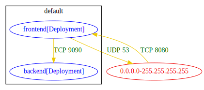

# List command - connectivity analysis output

Resource manifests considered for a connectivity analysis:
- workload resources (such as Kubernetes Pod / Deployment)
- Kubernetes NetworkPolicy
- Kubernetes Ingress
- Openshift Route

The connectivity output consists of lines of the form: `src` => `dst` : `connections`

For connections inferred from network policy resources only, the `src` and `dst` are workloads or external IP-blocks.

Details on Ingress/Route analysis are specified [here](docs/ingress_analysis.md).

## Example Output

`list` output in `txt` format:
```
$ ./bin/k8snetpolicy list --dirpath tests/netpol-analysis-example-minimal/

0.0.0.0-255.255.255.255 => default/frontend[Deployment] : TCP 8080
default/frontend[Deployment] => 0.0.0.0-255.255.255.255 : UDP 53
default/frontend[Deployment] => default/backend[Deployment] : TCP 9090
```

`list` output in `md` format:
```
$ ./bin/k8snetpolicy list --dirpath tests/netpol-analysis-example-minimal/ -o md
```
| src | dst | conn |
|-----|-----|------|
| 0.0.0.0-255.255.255.255 | default/frontend[Deployment] | TCP 8080 |
| default/frontend[Deployment] | 0.0.0.0-255.255.255.255 | UDP 53 |
| default/frontend[Deployment] | default/backend[Deployment] | TCP 9090 |

`list` output in `csv` format:
```
$ ./bin/k8snetpolicy list --dirpath tests/netpol-analysis-example-minimal/ -o csv

src,dst,conn
0.0.0.0-255.255.255.255,default/frontend[Deployment],TCP 8080
default/frontend[Deployment],0.0.0.0-255.255.255.255,UDP 53
default/frontend[Deployment],default/backend[Deployment],TCP 9090
```

`list` output in `json` format:
```
$ ./bin/k8snetpolicy list --dirpath tests/netpol-analysis-example-minimal/ -o json

[
  {
    "src": "0.0.0.0-255.255.255.255",
    "dst": "default/frontend[Deployment]",
    "conn": "TCP 8080"
  },
  {
    "src": "default/frontend[Deployment]",
    "dst": "0.0.0.0-255.255.255.255",
    "conn": "UDP 53"
  },
  {
    "src": "default/frontend[Deployment]",
    "dst": "default/backend[Deployment]",
    "conn": "TCP 9090"
  }
]
```

`list` output in `dot` format:

In `dot` output graphs, all the peers of the analyzed cluster are grouped by their namespaces.
```
$ ./bin/k8snetpolicy list --dirpath tests/netpol-analysis-example-minimal/ -o dot

digraph {
	subgraph cluster_default {
		"default/backend[Deployment]" [label="backend[Deployment]" color="blue" fontcolor="blue"]
		"default/frontend[Deployment]" [label="frontend[Deployment]" color="blue" fontcolor="blue"]
		label="default"
	}
	"0.0.0.0-255.255.255.255" [label="0.0.0.0-255.255.255.255" color="red2" fontcolor="red2"]
	"0.0.0.0-255.255.255.255" -> "default/frontend[Deployment]" [label="TCP 8080" color="gold2" fontcolor="darkgreen"]
	"default/frontend[Deployment]" -> "0.0.0.0-255.255.255.255" [label="UDP 53" color="gold2" fontcolor="darkgreen"]
	"default/frontend[Deployment]" -> "default/backend[Deployment]" [label="TCP 9090" color="gold2" fontcolor="darkgreen"]
}
```

`svg` graph from `dot` format output can be produced using `graphviz` as following:
```
$ dot -Tsvg test_outputs/connlist/netpol-analysis-example-minimal_connlist_output.dot -O
```
The frames in the graph represent namespaces of the analyzed cluster.


