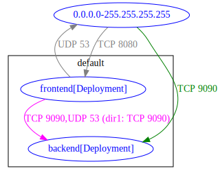
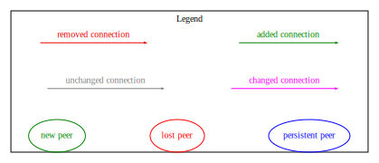

# Diff command - connectivity diff output :

Diff command requires two folders, dir1 and dir2, each containing Kubernetes manifests, including network policies. 
The diff output provides a summary of changed/added/removed connections from dir2 with respect to allowed connections from dir1.

## Examples Output 

Diff output in `txt` format:
```
$ ./bin/k8snetpolicy diff --dir1 tests/netpol-analysis-example-minimal/ --dir2 tests/netpol-diff-example-minimal/ -o txt

Connectivity diff:
diff-type: changed, source: default/frontend[Deployment], destination: default/backend[Deployment], dir1:  TCP 9090, dir2: TCP 9090,UDP 53
diff-type: added, source: 0.0.0.0-255.255.255.255, destination: default/backend[Deployment], dir1:  No Connections, dir2: TCP 9090
```

Diff output in `md` format:
```
$ ./bin/k8snetpolicy diff --dir1 tests/netpol-analysis-example-minimal/ --dir2 tests/netpol-diff-example-minimal/ -o md
```

| diff-type | source | destination | dir1 | dir2 | workloads-diff-info |
|-----------|--------|-------------|------|------|---------------------|
| changed | default/frontend[Deployment] | default/backend[Deployment] | TCP 9090 | TCP 9090,UDP 53 |  |
| added | 0.0.0.0-255.255.255.255 | default/backend[Deployment] | No Connections | TCP 9090 |  |

Diff output in `csv` format:
```
$ ./bin/k8snetpolicy diff --dir1 tests/netpol-analysis-example-minimal/ --dir2 tests/netpol-diff-example-minimal/ -o csv

diff-type,source,destination,dir1,dir2,workloads-diff-info
changed,default/frontend[Deployment],default/backend[Deployment],TCP 9090,"TCP 9090,UDP 53",
added,0.0.0.0-255.255.255.255,default/backend[Deployment],No Connections,TCP 9090,
```

Diff output in `dot` format:
```
$ ./bin/k8snetpolicy diff --dir1 tests/netpol-analysis-example-minimal/ --dir2 tests/netpol-diff-example-minimal/ -o dot

digraph {
        "0.0.0.0-255.255.255.255" [label="0.0.0.0-255.255.255.255" color="blue" fontcolor="blue"]
        "default/backend[Deployment]" [label="default/backend[Deployment]" color="blue" fontcolor="blue"]
        "default/frontend[Deployment]" [label="default/frontend[Deployment]" color="blue" fontcolor="blue"]
        "0.0.0.0-255.255.255.255" -> "default/backend[Deployment]" [label="TCP 9090" color="#008000" fontcolor="#008000"]
        "0.0.0.0-255.255.255.255" -> "default/frontend[Deployment]" [label="TCP 8080" color="grey" fontcolor="grey"]
        "default/frontend[Deployment]" -> "0.0.0.0-255.255.255.255" [label="UDP 53" color="grey" fontcolor="grey"]
        "default/frontend[Deployment]" -> "default/backend[Deployment]" [label="TCP 9090,UDP 53 (old: TCP 9090)" color="magenta" fontcolor="magenta"]
}
```

`svg` graph from `dot` format output can be produced using `graphviz` as following:

```
$ dot -Tsvg tests/netpol-diff-example-minimal/diff_output_from_netpol-analysis-example-minimal.dot -o tests/netpol-diff-example-minimal/diff_output_from_netpol-analysis-example.svg

```


### Understanding the output
Each line in the output represents an allowed connection that has been added/removed/changed on dir2 with respect to dir1. The `workloads-diff-info` adds information about added/removed workload related to the added/removed connection, if relevant.

#### DOT Graph Legend:

