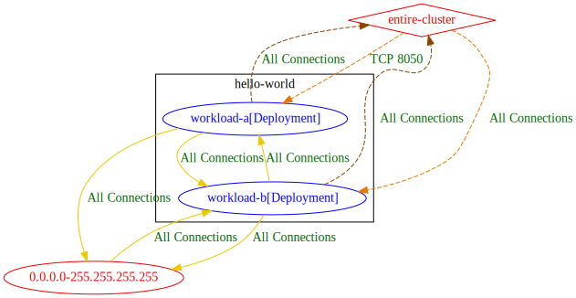
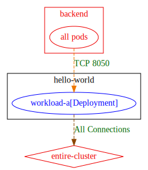
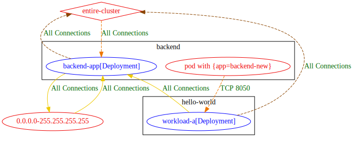
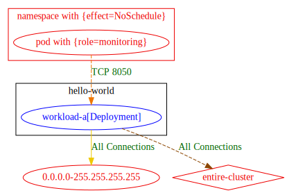
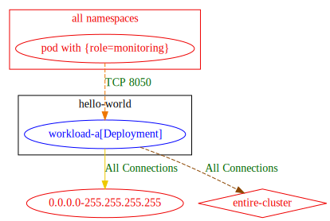

# Exposure analysis - enhance `list` connectivity analysis

## Motivation

`list` without `--exposure`, produces a report of permitted connectivity, where the endpoints are k8s workloads that exist in the input manifests and external IP ranges.\
It does not take into account potential permitted connectivity to workload entities that may be matched by policy rules, but do not exist in the input manifests.

The goal of exposure analysis, is to provide this additional information of potential permitted connectivity.
The report can give hints to where network policies may be tightened, or help validate that no unexpected exposure is present due to policies misconfiguration. 

The exposure analysis is supported for all output formats of the `list` command. 
To run exposure analysis, just run the `list` command with the additional `--exposure` flag. 

The section below, details few examples of input manifests for workloads and network policies, and shows the output result of exposure analysis in both text and graphical formats.


## Examples

### Example with exposure to entire cluster 

In the example below, the output with exposure analysis, shows that `workload-a` is exposed to entire cluster (both ingress and egress), and also to external IP ranges on egress.

#### Input Manifests:
Namespaces and Pods:
```
---
apiVersion: v1
kind: Namespace
metadata:
  name: hello-world
spec: {}
---
apiVersion: apps/v1
kind: Deployment
metadata:
  name: workload-a
  namespace: hello-world
  labels:
    app: a-app
spec:
  selector:
    matchLabels:
      app: a-app
  template:
    metadata:
      labels:
        app: a-app
    spec:
      containers:
      - name: hello-world
        image: quay.io/shfa/hello-world:latest
        ports:
        - containerPort: 8000  # containerport1
        - containerPort: 8050  # containerport2
        - containerPort: 8090  # containerport3
---
apiVersion: apps/v1
kind: Deployment
metadata:
  name: workload-b
  namespace: hello-world
  labels:
    app: b-app
spec:
  selector:
    matchLabels:
      app: b-app
  template:
    metadata:
      labels:
        app: b-app
    spec:
      containers:
      - name: hello-world
        image: quay.io/shfa/hello-world:latest
        ports:
        - containerPort: 8050

```
Policies:
```
kind: NetworkPolicy
apiVersion: networking.k8s.io/v1
metadata:
  name: combined-ingress-rules
  namespace: hello-world
spec:
  podSelector:
    matchLabels:
      app: a-app
  ingress:
  - from:
    - namespaceSelector:
        matchLabels:
          kubernetes.io/metadata.name: hello-world
      podSelector:
        matchLabels:
          app: b-app
  - from:
    - namespaceSelector:
           matchExpressions:
           - key: foo.com/managed-state
             operator: In
             values:
             - managed
    ports:
    - port: 8050
      protocol: TCP
  - from:
    - namespaceSelector: {}
    ports:
    - port: 8050
      protocol: TCP
```
#### Textual Result:
```
0.0.0.0-255.255.255.255 => hello-world/workload-b[Deployment] : All Connections
hello-world/workload-a[Deployment] => 0.0.0.0-255.255.255.255 : All Connections
hello-world/workload-a[Deployment] => hello-world/workload-b[Deployment] : All Connections
hello-world/workload-b[Deployment] => 0.0.0.0-255.255.255.255 : All Connections
hello-world/workload-b[Deployment] => hello-world/workload-a[Deployment] : All Connections

Exposure Analysis Result:
Egress Exposure:
hello-world/workload-a[Deployment] 	=> 	0.0.0.0-255.255.255.255 : All Connections
hello-world/workload-a[Deployment] 	=> 	entire-cluster : All Connections
hello-world/workload-b[Deployment] 	=> 	0.0.0.0-255.255.255.255 : All Connections
hello-world/workload-b[Deployment] 	=> 	entire-cluster : All Connections

Ingress Exposure:
hello-world/workload-a[Deployment] 	<= 	entire-cluster : TCP 8050
hello-world/workload-b[Deployment] 	<= 	0.0.0.0-255.255.255.255 : All Connections
hello-world/workload-b[Deployment] 	<= 	entire-cluster : All Connections

Workloads not protected by network policies:
hello-world/workload-a[Deployment] is not protected on Egress
hello-world/workload-b[Deployment] is not protected on Egress
hello-world/workload-b[Deployment] is not protected on Ingress

```
#### Graphical Result:



### Example with exposure to entire namespace

In the example below, `workload-a` is exposed on ingress to all Pods in the `backend` namespace.

#### Input Manifests:
Namespaces and Pods:
```
---
apiVersion: v1
kind: Namespace
metadata:
  name: hello-world
spec: {}
---
apiVersion: apps/v1
kind: Deployment
metadata:
  name: workload-a
  namespace: hello-world
  labels:
    app: a-app
spec:
  selector:
    matchLabels:
      app: a-app
  template:
    metadata:
      labels:
        app: a-app
    spec:
      containers:
      - name: hello-world
        image: quay.io/shfa/hello-world:latest
        ports:
        - containerPort: 8000  # containerport1
        - containerPort: 8050  # containerport2
        - containerPort: 8090  # containerport3
---

```
Policies:
```
kind: NetworkPolicy
apiVersion: networking.k8s.io/v1
metadata:
  name: allow-ingress-to-unknown-ns
  namespace: hello-world
spec:
  podSelector:
    matchLabels:
      app: a-app
  policyTypes:
  - Ingress
  - Egress
  ingress:
  - from:
    - namespaceSelector: 
        matchLabels:
            kubernetes.io/metadata.name: backend
      podSelector: {}
    ports:
    - port: 8050
      protocol: TCP
  egress:
  - to:
    - namespaceSelector: {}
      podSelector: {}
```
#### Textual Result:
```
Exposure Analysis Result:
Egress Exposure:
hello-world/workload-a[Deployment] 	=> 	entire-cluster : All Connections

Ingress Exposure:
hello-world/workload-a[Deployment] 	<= 	backend/[all pods] : TCP 8050

```
#### Graphical Result:



### Example of exposure to a certain workload with specified labels

In the example below, `workload-a` is exposed to any Pod with labels `app=backend-new` on the `backend` namespace. 

#### Input Manifests:
Namespaces and Pods:
```
---
apiVersion: apps/v1
kind: Deployment
metadata:
  name: backend-app
  namespace: backend
spec:
  selector:
    matchLabels:
      app: backendservice
  template:
    metadata:
      labels:
        app: backendservice
    spec:
      containers:
      - name: server
        image: backendservice
        ports:
        - containerPort: 9090
        readinessProbe:
          initialDelaySeconds: 10
          httpGet:
            path: "/_healthz"
            port: 9090
        livenessProbe:
          initialDelaySeconds: 10
          httpGet:
            path: "/_healthz"
            port: 9090
        env:
        - name: PORT
          value: "9090"
        resources:
          requests:
            cpu: 100m
            memory: 64Mi
          limits:
            cpu: 200m
            memory: 128Mi

---
apiVersion: v1
kind: Namespace
metadata:
  name: hello-world
spec: {}
---
apiVersion: apps/v1
kind: Deployment
metadata:
  name: workload-a
  namespace: hello-world
  labels:
    app: a-app
spec:
  selector:
    matchLabels:
      app: a-app
  template:
    metadata:
      labels:
        app: a-app
    spec:
      containers:
      - name: hello-world
        image: quay.io/shfa/hello-world:latest
        ports:
        - containerPort: 8000  # containerport1
        - containerPort: 8050  # containerport2
        - containerPort: 8090  # containerport3
---

```
Policies:
```
kind: NetworkPolicy
apiVersion: networking.k8s.io/v1
metadata:
  name: allow-ingress-to-unknown-ns
  namespace: hello-world
spec:
  podSelector:
    matchLabels:
      app: a-app
  policyTypes:
  - Ingress
  - Egress
  ingress:
  - from:
    - namespaceSelector: 
        matchLabels:
            kubernetes.io/metadata.name: backend
      podSelector: 
        matchLabels:
            app: backend-new
    ports:
    - port: 8050
      protocol: TCP
  egress:
  - to:
    - namespaceSelector: {}
      podSelector: {}
```
#### Textual Result:
```
0.0.0.0-255.255.255.255 => backend/backend-app[Deployment] : All Connections
backend/backend-app[Deployment] => 0.0.0.0-255.255.255.255 : All Connections
hello-world/workload-a[Deployment] => backend/backend-app[Deployment] : All Connections

Exposure Analysis Result:
Egress Exposure:
backend/backend-app[Deployment]    	=> 	0.0.0.0-255.255.255.255 : All Connections
backend/backend-app[Deployment]    	=> 	entire-cluster : All Connections
hello-world/workload-a[Deployment] 	=> 	entire-cluster : All Connections

Ingress Exposure:
backend/backend-app[Deployment]    	<= 	0.0.0.0-255.255.255.255 : All Connections
backend/backend-app[Deployment]    	<= 	entire-cluster : All Connections
hello-world/workload-a[Deployment] 	<= 	backend/[pod with {app=backend-new}] : TCP 8050

Workloads not protected by network policies:
backend/backend-app[Deployment] is not protected on Egress
backend/backend-app[Deployment] is not protected on Ingress

```
#### Graphical Result:



### Example of exposure from certain Namespace labels and Pod labels specified

In the example below, `workload-a` is exposed to any Pod with labels `role=monitoring`, in any Namespace with labels `effect=NoSchedule`.

#### Input Manifests:
Namespaces and Pods:
```
---
apiVersion: v1
kind: Namespace
metadata:
  name: hello-world
spec: {}
---
apiVersion: apps/v1
kind: Deployment
metadata:
  name: workload-a
  namespace: hello-world
  labels:
    app: a-app
spec:
  selector:
    matchLabels:
      app: a-app
  template:
    metadata:
      labels:
        app: a-app
    spec:
      containers:
      - name: hello-world
        image: quay.io/shfa/hello-world:latest
        ports:
        - containerPort: 8000  # containerport1
        - containerPort: 8050  # containerport2
        - containerPort: 8090  # containerport3
---

```
Policies:
```
kind: NetworkPolicy
apiVersion: networking.k8s.io/v1
metadata:
  name: allow-ingress-ns-and-pod-selectors
  namespace: hello-world
spec:
  podSelector:
    matchLabels:
      app: a-app
  policyTypes:
  - Ingress
  ingress:
  - from:
    - namespaceSelector:
        matchLabels:
          effect: "NoSchedule"
      podSelector: 
        matchLabels:
            role: monitoring
    ports:
    - port: 8050
      protocol: TCP

```
#### Textual Result:
```
hello-world/workload-a[Deployment] => 0.0.0.0-255.255.255.255 : All Connections

Exposure Analysis Result:
Egress Exposure:
hello-world/workload-a[Deployment] 	=> 	0.0.0.0-255.255.255.255 : All Connections
hello-world/workload-a[Deployment] 	=> 	entire-cluster : All Connections

Ingress Exposure:
hello-world/workload-a[Deployment] 	<= 	[namespace with {effect=NoSchedule}]/[pod with {role=monitoring}] : TCP 8050

Workloads not protected by network policies:
hello-world/workload-a[Deployment] is not protected on Egress

```
#### Graphical Result:



### Example of exposure from certain Pod labels on all cluster namespaces

In the example below, `workload-a` is exposed to all workloads with labels `role=monitoring`, on all namespaces.

#### Input Manifests:
Namespaces and Pods:
```
---
apiVersion: v1
kind: Namespace
metadata:
  name: hello-world
spec: {}
---
apiVersion: apps/v1
kind: Deployment
metadata:
  name: workload-a
  namespace: hello-world
  labels:
    app: a-app
spec:
  selector:
    matchLabels:
      app: a-app
  template:
    metadata:
      labels:
        app: a-app
    spec:
      containers:
      - name: hello-world
        image: quay.io/shfa/hello-world:latest
        ports:
        - containerPort: 8000  # containerport1
        - containerPort: 8050  # containerport2
        - containerPort: 8090  # containerport3
---

```
Policies:
```
kind: NetworkPolicy
apiVersion: networking.k8s.io/v1
metadata:
  name: allow-ingress-to-pod-in-any-ns
  namespace: hello-world
spec:
  podSelector:
    matchLabels:
      app: a-app
  policyTypes:
  - Ingress
  ingress:
  - from:
    - namespaceSelector: {}
      podSelector: 
        matchLabels:
            role: monitoring
    ports:
    - port: 8050
      protocol: TCP

```
#### Textual Result:
```
hello-world/workload-a[Deployment] => 0.0.0.0-255.255.255.255 : All Connections

Exposure Analysis Result:
Egress Exposure:
hello-world/workload-a[Deployment] 	=> 	0.0.0.0-255.255.255.255 : All Connections
hello-world/workload-a[Deployment] 	=> 	entire-cluster : All Connections

Ingress Exposure:
hello-world/workload-a[Deployment] 	<= 	[all namespaces]/[pod with {role=monitoring}] : TCP 8050

Workloads not protected by network policies:
hello-world/workload-a[Deployment] is not protected on Egress

```
#### Graphical Result:

