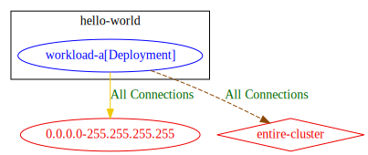
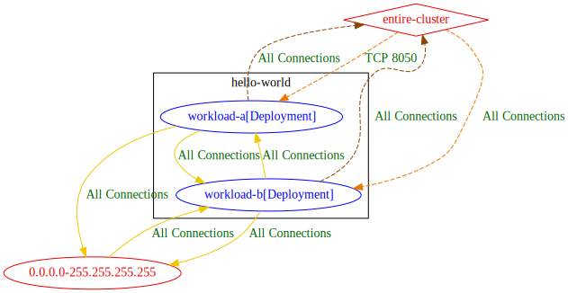
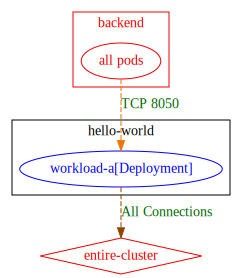
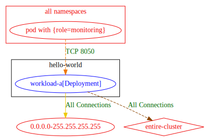
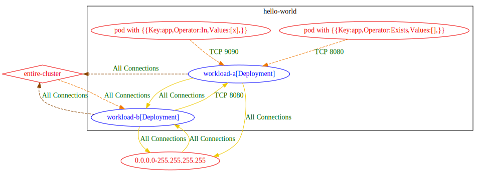
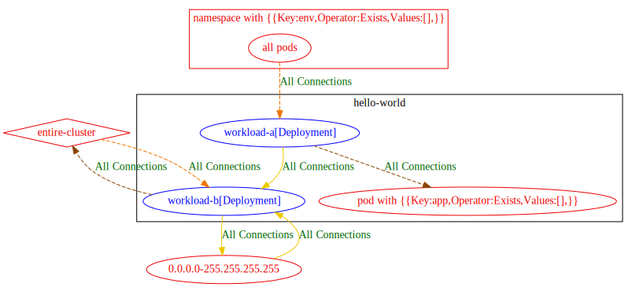

## Exposure Analysis Tests

### _Test Name: exposure_allow_all_in_cluster_test_
#### Input Manifests:
Namespaces and Pods:
```
---
apiVersion: v1
kind: Namespace
metadata:
  name: hello-world
spec: {}
---
apiVersion: apps/v1
kind: Deployment
metadata:
  name: workload-a
  namespace: hello-world
  labels:
    app: a-app
spec:
  selector:
    matchLabels:
      app: a-app
  template:
    metadata:
      labels:
        app: a-app
    spec:
      containers:
      - name: hello-world
        image: quay.io/shfa/hello-world:latest
        ports:
        - containerPort: 8000  # containerport1
        - containerPort: 8050  # containerport2
        - containerPort: 8090  # containerport3
---

```
Policies:
```
kind: NetworkPolicy
apiVersion: networking.k8s.io/v1
metadata:
  name: allow-ingress-and-egress-in-entire-cluster
  namespace: hello-world
spec:
  podSelector:
    matchLabels:
      app: a-app
  policyTypes:
  - Ingress
  - Egress
  ingress:
  - from:
    - namespaceSelector: {}
    ports:
    - port: 8050
      protocol: TCP
  egress:
  - to:
    - namespaceSelector: {}
```
#### Textual Result:
```
Exposure Analysis Result:
Egress Exposure:
hello-world/workload-a[Deployment] 	=> 	entire-cluster : All Connections

Ingress Exposure:
hello-world/workload-a[Deployment] 	<= 	entire-cluster : TCP 8050

```
#### Graphical Result:


### _Test Name: exposure_allow_all_test_
#### Input Manifests:
Namespaces and Pods:
```
---
apiVersion: v1
kind: Namespace
metadata:
  name: hello-world
spec: {}
---
apiVersion: apps/v1
kind: Deployment
metadata:
  name: workload-a
  namespace: hello-world
  labels:
    app: a-app
spec:
  selector:
    matchLabels:
      app: a-app
  template:
    metadata:
      labels:
        app: a-app
    spec:
      containers:
      - name: hello-world
        image: quay.io/shfa/hello-world:latest
        ports:
        - containerPort: 8000  # containerport1
        - containerPort: 8050  # containerport2
        - containerPort: 8090  # containerport3
---

```
Policies:
```
kind: NetworkPolicy
apiVersion: networking.k8s.io/v1
metadata:
  name: allow-conns-to-all-world
  namespace: hello-world
spec:
  podSelector:
    matchLabels:
      app: a-app
  policyTypes:
  - Ingress
  - Egress
  ingress:
  - {}
  egress:
  - {}
```
#### Textual Result:
```
0.0.0.0-255.255.255.255 => hello-world/workload-a[Deployment] : All Connections
hello-world/workload-a[Deployment] => 0.0.0.0-255.255.255.255 : All Connections

Exposure Analysis Result:
Egress Exposure:
hello-world/workload-a[Deployment] 	=> 	0.0.0.0-255.255.255.255 : All Connections
hello-world/workload-a[Deployment] 	=> 	entire-cluster : All Connections

Ingress Exposure:
hello-world/workload-a[Deployment] 	<= 	0.0.0.0-255.255.255.255 : All Connections
hello-world/workload-a[Deployment] 	<= 	entire-cluster : All Connections

```
#### Graphical Result:


### _Test Name: exposure_allow_egress_deny_ingress_test_
#### Input Manifests:
Namespaces and Pods:
```
---
apiVersion: v1
kind: Namespace
metadata:
  name: hello-world
spec: {}
---
apiVersion: apps/v1
kind: Deployment
metadata:
  name: workload-a
  namespace: hello-world
  labels:
    app: a-app
spec:
  selector:
    matchLabels:
      app: a-app
  template:
    metadata:
      labels:
        app: a-app
    spec:
      containers:
      - name: hello-world
        image: quay.io/shfa/hello-world:latest
        ports:
        - containerPort: 8000  # containerport1
        - containerPort: 8050  # containerport2
        - containerPort: 8090  # containerport3
---

```
Policies:
```
kind: NetworkPolicy
apiVersion: networking.k8s.io/v1
metadata:
  name: allow-ingress-deny-egress
  namespace: hello-world
spec:
  podSelector:
    matchLabels:
      app: a-app
  policyTypes:
  - Ingress
  - Egress
  egress:
  - {}
```
#### Textual Result:
```
hello-world/workload-a[Deployment] => 0.0.0.0-255.255.255.255 : All Connections

Exposure Analysis Result:
Egress Exposure:
hello-world/workload-a[Deployment] 	=> 	0.0.0.0-255.255.255.255 : All Connections
hello-world/workload-a[Deployment] 	=> 	entire-cluster : All Connections

```
#### Graphical Result:


### _Test Name: exposure_allow_ingress_deny_egress_test_
#### Input Manifests:
Namespaces and Pods:
```
---
apiVersion: v1
kind: Namespace
metadata:
  name: hello-world
spec: {}
---
apiVersion: apps/v1
kind: Deployment
metadata:
  name: workload-a
  namespace: hello-world
  labels:
    app: a-app
spec:
  selector:
    matchLabels:
      app: a-app
  template:
    metadata:
      labels:
        app: a-app
    spec:
      containers:
      - name: hello-world
        image: quay.io/shfa/hello-world:latest
        ports:
        - containerPort: 8000  # containerport1
        - containerPort: 8050  # containerport2
        - containerPort: 8090  # containerport3
---

```
Policies:
```
kind: NetworkPolicy
apiVersion: networking.k8s.io/v1
metadata:
  name: allow-ingress-deny-egress
  namespace: hello-world
spec:
  podSelector:
    matchLabels:
      app: a-app
  policyTypes:
  - Ingress
  - Egress
  ingress:
  - {}
```
#### Textual Result:
```
0.0.0.0-255.255.255.255 => hello-world/workload-a[Deployment] : All Connections

Exposure Analysis Result:
Ingress Exposure:
hello-world/workload-a[Deployment] 	<= 	0.0.0.0-255.255.255.255 : All Connections
hello-world/workload-a[Deployment] 	<= 	entire-cluster : All Connections

```
#### Graphical Result:


### _Test Name: exposure_matched_and_unmatched_rules_test_
#### Input Manifests:
Namespaces and Pods:
```
---
apiVersion: v1
kind: Namespace
metadata:
  name: hello-world
spec: {}
---
apiVersion: apps/v1
kind: Deployment
metadata:
  name: workload-a
  namespace: hello-world
  labels:
    app: a-app
spec:
  selector:
    matchLabels:
      app: a-app
  template:
    metadata:
      labels:
        app: a-app
    spec:
      containers:
      - name: hello-world
        image: quay.io/shfa/hello-world:latest
        ports:
        - containerPort: 8000  # containerport1
        - containerPort: 8050  # containerport2
        - containerPort: 8090  # containerport3
---
apiVersion: apps/v1
kind: Deployment
metadata:
  name: workload-b
  namespace: hello-world
  labels:
    app: b-app
spec:
  selector:
    matchLabels:
      app: b-app
  template:
    metadata:
      labels:
        app: b-app
    spec:
      containers:
      - name: hello-world
        image: quay.io/shfa/hello-world:latest
        ports:
        - containerPort: 8050

```
Policies:
```
kind: NetworkPolicy
apiVersion: networking.k8s.io/v1
metadata:
  name: combined-ingress-rules
  namespace: hello-world
spec:
  podSelector:
    matchLabels:
      app: a-app
  ingress:
  - from:
    - namespaceSelector:
        matchLabels:
          kubernetes.io/metadata.name: hello-world
      podSelector:
        matchLabels:
          app: b-app
  - from:
    - namespaceSelector:
           matchExpressions:
           - key: foo.com/managed-state
             operator: In
             values:
             - managed
    ports:
    - port: 8050
      protocol: TCP
  - from:
    - namespaceSelector: {}
    ports:
    - port: 8050
      protocol: TCP
```
#### Textual Result:
```
0.0.0.0-255.255.255.255 => hello-world/workload-b[Deployment] : All Connections
hello-world/workload-a[Deployment] => 0.0.0.0-255.255.255.255 : All Connections
hello-world/workload-a[Deployment] => hello-world/workload-b[Deployment] : All Connections
hello-world/workload-b[Deployment] => 0.0.0.0-255.255.255.255 : All Connections
hello-world/workload-b[Deployment] => hello-world/workload-a[Deployment] : All Connections

Exposure Analysis Result:
Egress Exposure:
hello-world/workload-a[Deployment] 	=> 	0.0.0.0-255.255.255.255 : All Connections
hello-world/workload-a[Deployment] 	=> 	entire-cluster : All Connections
hello-world/workload-b[Deployment] 	=> 	0.0.0.0-255.255.255.255 : All Connections
hello-world/workload-b[Deployment] 	=> 	entire-cluster : All Connections

Ingress Exposure:
hello-world/workload-a[Deployment] 	<= 	entire-cluster : TCP 8050
hello-world/workload-b[Deployment] 	<= 	0.0.0.0-255.255.255.255 : All Connections
hello-world/workload-b[Deployment] 	<= 	entire-cluster : All Connections

Workloads not protected by network policies:
hello-world/workload-a[Deployment] is not protected on Egress
hello-world/workload-b[Deployment] is not protected on Egress
hello-world/workload-b[Deployment] is not protected on Ingress

```
#### Graphical Result:


### _Test Name: exposure_multiple_unmatched_rules_test_
#### Input Manifests:
Namespaces and Pods:
```
---
apiVersion: v1
kind: Namespace
metadata:
  name: hello-world
spec: {}
---
apiVersion: apps/v1
kind: Deployment
metadata:
  name: workload-a
  namespace: hello-world
  labels:
    app: a-app
spec:
  selector:
    matchLabels:
      app: a-app
  template:
    metadata:
      labels:
        app: a-app
    spec:
      containers:
      - name: hello-world
        image: quay.io/shfa/hello-world:latest
        ports:
        - containerPort: 8000  # containerport1
        - containerPort: 8050  # containerport2
        - containerPort: 8090  # containerport3
---

```
Policies:
```
kind: NetworkPolicy
apiVersion: networking.k8s.io/v1
metadata:
  name: combined-ingress-rules
  namespace: hello-world
spec:
  podSelector:
    matchLabels:
      app: a-app
  ingress:
  - from:
    - namespaceSelector:
        matchLabels:
          release : "stable"
  - from:
    - namespaceSelector:
           matchExpressions:
           - key: foo.com/managed-state
             operator: In
             values:
             - managed
    ports:
    - port: 8050
      protocol: TCP
  - from:
    - namespaceSelector: 
        matchLabels:
          effect: "NoSchedule"
    ports:
    - port: 8050
      protocol: TCP
```
#### Textual Result:
```
hello-world/workload-a[Deployment] => 0.0.0.0-255.255.255.255 : All Connections

Exposure Analysis Result:
Egress Exposure:
hello-world/workload-a[Deployment] 	=> 	0.0.0.0-255.255.255.255 : All Connections
hello-world/workload-a[Deployment] 	=> 	entire-cluster : All Connections

Ingress Exposure:
hello-world/workload-a[Deployment] 	<= 	[namespace with {effect=NoSchedule}]/[all pods] : TCP 8050
hello-world/workload-a[Deployment] 	<= 	[namespace with {release=stable}]/[all pods] : All Connections
hello-world/workload-a[Deployment] 	<= 	[namespace with {{Key:foo.com/managed-state,Operator:In,Values:[managed],}}]/[all pods] : TCP 8050

Workloads not protected by network policies:
hello-world/workload-a[Deployment] is not protected on Egress

```
#### Graphical Result:


### _Test Name: exposure_only_matched_rules_test_
#### Input Manifests:
Namespaces and Pods:
```
---
apiVersion: v1
kind: Namespace
metadata:
  name: hello-world
spec: {}
---
apiVersion: apps/v1
kind: Deployment
metadata:
  name: workload-a
  namespace: hello-world
  labels:
    app: a-app
spec:
  selector:
    matchLabels:
      app: a-app
  template:
    metadata:
      labels:
        app: a-app
    spec:
      containers:
      - name: hello-world
        image: quay.io/shfa/hello-world:latest
        ports:
        - containerPort: 8000  # containerport1
        - containerPort: 8050  # containerport2
        - containerPort: 8090  # containerport3
---
apiVersion: apps/v1
kind: Deployment
metadata:
  name: workload-b
  namespace: hello-world
  labels:
    app: b-app
spec:
  selector:
    matchLabels:
      app: b-app
  template:
    metadata:
      labels:
        app: b-app
    spec:
      containers:
      - name: hello-world
        image: quay.io/shfa/hello-world:latest
        ports:
        - containerPort: 8050

```
Policies:
```
kind: NetworkPolicy
apiVersion: networking.k8s.io/v1
metadata:
  name: only-matched-rules
  namespace: hello-world
spec:
  podSelector:
    matchLabels:
      app: a-app
  ingress:
  - from:
    - namespaceSelector:
        matchLabels:
          kubernetes.io/metadata.name: hello-world
      podSelector:
        matchLabels:
          app: b-app
  egress:
  - to:
    - namespaceSelector:
        matchLabels:
          kubernetes.io/metadata.name: hello-world
      podSelector:
        matchLabels:
          app: b-app

```
#### Textual Result:
```
0.0.0.0-255.255.255.255 => hello-world/workload-b[Deployment] : All Connections
hello-world/workload-a[Deployment] => hello-world/workload-b[Deployment] : All Connections
hello-world/workload-b[Deployment] => 0.0.0.0-255.255.255.255 : All Connections
hello-world/workload-b[Deployment] => hello-world/workload-a[Deployment] : All Connections

Exposure Analysis Result:
Egress Exposure:
hello-world/workload-b[Deployment] 	=> 	0.0.0.0-255.255.255.255 : All Connections
hello-world/workload-b[Deployment] 	=> 	entire-cluster : All Connections

Ingress Exposure:
hello-world/workload-b[Deployment] 	<= 	0.0.0.0-255.255.255.255 : All Connections
hello-world/workload-b[Deployment] 	<= 	entire-cluster : All Connections

Workloads not protected by network policies:
hello-world/workload-b[Deployment] is not protected on Egress
hello-world/workload-b[Deployment] is not protected on Ingress

```
#### Graphical Result:


### _Test Name: exposure_test_conn_entire_cluster_with_empty_selectors_
#### Input Manifests:
Namespaces and Pods:
```
---
apiVersion: v1
kind: Namespace
metadata:
  name: hello-world
spec: {}
---
apiVersion: apps/v1
kind: Deployment
metadata:
  name: workload-a
  namespace: hello-world
  labels:
    app: a-app
spec:
  selector:
    matchLabels:
      app: a-app
  template:
    metadata:
      labels:
        app: a-app
    spec:
      containers:
      - name: hello-world
        image: quay.io/shfa/hello-world:latest
        ports:
        - containerPort: 8000  # containerport1
        - containerPort: 8050  # containerport2
        - containerPort: 8090  # containerport3
---

```
Policies:
```
kind: NetworkPolicy
apiVersion: networking.k8s.io/v1
metadata:
  name: allow-ingress-and-egress-in-entire-cluster
  namespace: hello-world
spec:
  podSelector:
    matchLabels:
      app: a-app
  policyTypes:
  - Ingress
  - Egress
  ingress:
  - from:
    - namespaceSelector: {}
      podSelector: {}
    ports:
    - port: 8050
      protocol: TCP
  egress:
  - to:
    - namespaceSelector: {}
      podSelector: {}
```
#### Textual Result:
```
Exposure Analysis Result:
Egress Exposure:
hello-world/workload-a[Deployment] 	=> 	entire-cluster : All Connections

Ingress Exposure:
hello-world/workload-a[Deployment] 	<= 	entire-cluster : TCP 8050

```
#### Graphical Result:


### _Test Name: exposure_test_conn_to_all_pods_in_a_new_ns_
#### Input Manifests:
Namespaces and Pods:
```
---
apiVersion: v1
kind: Namespace
metadata:
  name: hello-world
spec: {}
---
apiVersion: apps/v1
kind: Deployment
metadata:
  name: workload-a
  namespace: hello-world
  labels:
    app: a-app
spec:
  selector:
    matchLabels:
      app: a-app
  template:
    metadata:
      labels:
        app: a-app
    spec:
      containers:
      - name: hello-world
        image: quay.io/shfa/hello-world:latest
        ports:
        - containerPort: 8000  # containerport1
        - containerPort: 8050  # containerport2
        - containerPort: 8090  # containerport3
---

```
Policies:
```
kind: NetworkPolicy
apiVersion: networking.k8s.io/v1
metadata:
  name: allow-ingress-to-unknown-ns
  namespace: hello-world
spec:
  podSelector:
    matchLabels:
      app: a-app
  policyTypes:
  - Ingress
  - Egress
  ingress:
  - from:
    - namespaceSelector: 
        matchLabels:
            kubernetes.io/metadata.name: backend
      podSelector: {}
    ports:
    - port: 8050
      protocol: TCP
  egress:
  - to:
    - namespaceSelector: {}
      podSelector: {}
```
#### Textual Result:
```
Exposure Analysis Result:
Egress Exposure:
hello-world/workload-a[Deployment] 	=> 	entire-cluster : All Connections

Ingress Exposure:
hello-world/workload-a[Deployment] 	<= 	backend/[all pods] : TCP 8050

```
#### Graphical Result:


### _Test Name: exposure_test_conn_to_all_pods_in_an_existing_ns_
#### Input Manifests:
Namespaces and Pods:
```
---
apiVersion: apps/v1
kind: Deployment
metadata:
  name: backend-app
  namespace: backend
spec:
  selector:
    matchLabels:
      app: backendservice
  template:
    metadata:
      labels:
        app: backendservice
    spec:
      containers:
      - name: server
        image: backendservice
        ports:
        - containerPort: 9090
        readinessProbe:
          initialDelaySeconds: 10
          httpGet:
            path: "/_healthz"
            port: 9090
        livenessProbe:
          initialDelaySeconds: 10
          httpGet:
            path: "/_healthz"
            port: 9090
        env:
        - name: PORT
          value: "9090"
        resources:
          requests:
            cpu: 100m
            memory: 64Mi
          limits:
            cpu: 200m
            memory: 128Mi

---
apiVersion: v1
kind: Namespace
metadata:
  name: hello-world
spec: {}
---
apiVersion: apps/v1
kind: Deployment
metadata:
  name: workload-a
  namespace: hello-world
  labels:
    app: a-app
spec:
  selector:
    matchLabels:
      app: a-app
  template:
    metadata:
      labels:
        app: a-app
    spec:
      containers:
      - name: hello-world
        image: quay.io/shfa/hello-world:latest
        ports:
        - containerPort: 8000  # containerport1
        - containerPort: 8050  # containerport2
        - containerPort: 8090  # containerport3
---

```
Policies:
```
kind: NetworkPolicy
apiVersion: networking.k8s.io/v1
metadata:
  name: allow-ingress-to-unknown-ns
  namespace: hello-world
spec:
  podSelector:
    matchLabels:
      app: a-app
  policyTypes:
  - Ingress
  - Egress
  ingress:
  - from:
    - namespaceSelector: 
        matchLabels:
            kubernetes.io/metadata.name: backend
      podSelector: {}
    ports:
    - port: 8050
      protocol: TCP
  egress:
  - to:
    - namespaceSelector: {}
      podSelector: {}
```
#### Textual Result:
```
0.0.0.0-255.255.255.255 => backend/backend-app[Deployment] : All Connections
backend/backend-app[Deployment] => 0.0.0.0-255.255.255.255 : All Connections
backend/backend-app[Deployment] => hello-world/workload-a[Deployment] : TCP 8050
hello-world/workload-a[Deployment] => backend/backend-app[Deployment] : All Connections

Exposure Analysis Result:
Egress Exposure:
backend/backend-app[Deployment]    	=> 	0.0.0.0-255.255.255.255 : All Connections
backend/backend-app[Deployment]    	=> 	entire-cluster : All Connections
hello-world/workload-a[Deployment] 	=> 	entire-cluster : All Connections

Ingress Exposure:
backend/backend-app[Deployment]    	<= 	0.0.0.0-255.255.255.255 : All Connections
backend/backend-app[Deployment]    	<= 	entire-cluster : All Connections
hello-world/workload-a[Deployment] 	<= 	backend/[all pods] : TCP 8050

Workloads not protected by network policies:
backend/backend-app[Deployment] is not protected on Egress
backend/backend-app[Deployment] is not protected on Ingress

```
#### Graphical Result:


### _Test Name: exposure_test_conn_to_all_pods_in_an_existing_ns_with_ns_selector_only_
#### Input Manifests:
Namespaces and Pods:
```
---
apiVersion: apps/v1
kind: Deployment
metadata:
  name: backend-app
  namespace: backend
spec:
  selector:
    matchLabels:
      app: backendservice
  template:
    metadata:
      labels:
        app: backendservice
    spec:
      containers:
      - name: server
        image: backendservice
        ports:
        - containerPort: 9090
        readinessProbe:
          initialDelaySeconds: 10
          httpGet:
            path: "/_healthz"
            port: 9090
        livenessProbe:
          initialDelaySeconds: 10
          httpGet:
            path: "/_healthz"
            port: 9090
        env:
        - name: PORT
          value: "9090"
        resources:
          requests:
            cpu: 100m
            memory: 64Mi
          limits:
            cpu: 200m
            memory: 128Mi

---
apiVersion: v1
kind: Namespace
metadata:
  name: hello-world
spec: {}
---
apiVersion: apps/v1
kind: Deployment
metadata:
  name: workload-a
  namespace: hello-world
  labels:
    app: a-app
spec:
  selector:
    matchLabels:
      app: a-app
  template:
    metadata:
      labels:
        app: a-app
    spec:
      containers:
      - name: hello-world
        image: quay.io/shfa/hello-world:latest
        ports:
        - containerPort: 8000  # containerport1
        - containerPort: 8050  # containerport2
        - containerPort: 8090  # containerport3
---

```
Policies:
```
kind: NetworkPolicy
apiVersion: networking.k8s.io/v1
metadata:
  name: allow-ingress-to-unknown-ns
  namespace: hello-world
spec:
  podSelector:
    matchLabels:
      app: a-app
  policyTypes:
  - Ingress
  - Egress
  ingress:
  - from:
    - namespaceSelector: 
        matchLabels:
            kubernetes.io/metadata.name: backend
    ports:
    - port: 8050
      protocol: TCP
  egress:
  - to:
    - namespaceSelector: {}
      podSelector: {}
```
#### Textual Result:
```
0.0.0.0-255.255.255.255 => backend/backend-app[Deployment] : All Connections
backend/backend-app[Deployment] => 0.0.0.0-255.255.255.255 : All Connections
backend/backend-app[Deployment] => hello-world/workload-a[Deployment] : TCP 8050
hello-world/workload-a[Deployment] => backend/backend-app[Deployment] : All Connections

Exposure Analysis Result:
Egress Exposure:
backend/backend-app[Deployment]    	=> 	0.0.0.0-255.255.255.255 : All Connections
backend/backend-app[Deployment]    	=> 	entire-cluster : All Connections
hello-world/workload-a[Deployment] 	=> 	entire-cluster : All Connections

Ingress Exposure:
backend/backend-app[Deployment]    	<= 	0.0.0.0-255.255.255.255 : All Connections
backend/backend-app[Deployment]    	<= 	entire-cluster : All Connections
hello-world/workload-a[Deployment] 	<= 	backend/[all pods] : TCP 8050

Workloads not protected by network policies:
backend/backend-app[Deployment] is not protected on Egress
backend/backend-app[Deployment] is not protected on Ingress

```
#### Graphical Result:


### _Test Name: exposure_test_conn_to_new_pod_in_an_existing_ns_
#### Input Manifests:
Namespaces and Pods:
```
---
apiVersion: apps/v1
kind: Deployment
metadata:
  name: backend-app
  namespace: backend
spec:
  selector:
    matchLabels:
      app: backendservice
  template:
    metadata:
      labels:
        app: backendservice
    spec:
      containers:
      - name: server
        image: backendservice
        ports:
        - containerPort: 9090
        readinessProbe:
          initialDelaySeconds: 10
          httpGet:
            path: "/_healthz"
            port: 9090
        livenessProbe:
          initialDelaySeconds: 10
          httpGet:
            path: "/_healthz"
            port: 9090
        env:
        - name: PORT
          value: "9090"
        resources:
          requests:
            cpu: 100m
            memory: 64Mi
          limits:
            cpu: 200m
            memory: 128Mi

---
apiVersion: v1
kind: Namespace
metadata:
  name: hello-world
spec: {}
---
apiVersion: apps/v1
kind: Deployment
metadata:
  name: workload-a
  namespace: hello-world
  labels:
    app: a-app
spec:
  selector:
    matchLabels:
      app: a-app
  template:
    metadata:
      labels:
        app: a-app
    spec:
      containers:
      - name: hello-world
        image: quay.io/shfa/hello-world:latest
        ports:
        - containerPort: 8000  # containerport1
        - containerPort: 8050  # containerport2
        - containerPort: 8090  # containerport3
---

```
Policies:
```
kind: NetworkPolicy
apiVersion: networking.k8s.io/v1
metadata:
  name: allow-ingress-to-unknown-ns
  namespace: hello-world
spec:
  podSelector:
    matchLabels:
      app: a-app
  policyTypes:
  - Ingress
  - Egress
  ingress:
  - from:
    - namespaceSelector: 
        matchLabels:
            kubernetes.io/metadata.name: backend
      podSelector: 
        matchLabels:
            app: backend-new
    ports:
    - port: 8050
      protocol: TCP
  egress:
  - to:
    - namespaceSelector: {}
      podSelector: {}
```
#### Textual Result:
```
0.0.0.0-255.255.255.255 => backend/backend-app[Deployment] : All Connections
backend/backend-app[Deployment] => 0.0.0.0-255.255.255.255 : All Connections
hello-world/workload-a[Deployment] => backend/backend-app[Deployment] : All Connections

Exposure Analysis Result:
Egress Exposure:
backend/backend-app[Deployment]    	=> 	0.0.0.0-255.255.255.255 : All Connections
backend/backend-app[Deployment]    	=> 	entire-cluster : All Connections
hello-world/workload-a[Deployment] 	=> 	entire-cluster : All Connections

Ingress Exposure:
backend/backend-app[Deployment]    	<= 	0.0.0.0-255.255.255.255 : All Connections
backend/backend-app[Deployment]    	<= 	entire-cluster : All Connections
hello-world/workload-a[Deployment] 	<= 	backend/[pod with {app=backend-new}] : TCP 8050

Workloads not protected by network policies:
backend/backend-app[Deployment] is not protected on Egress
backend/backend-app[Deployment] is not protected on Ingress

```
#### Graphical Result:


### _Test Name: exposure_test_conn_with_new_pod_selector_and_ns_selector_
#### Input Manifests:
Namespaces and Pods:
```
---
apiVersion: v1
kind: Namespace
metadata:
  name: hello-world
spec: {}
---
apiVersion: apps/v1
kind: Deployment
metadata:
  name: workload-a
  namespace: hello-world
  labels:
    app: a-app
spec:
  selector:
    matchLabels:
      app: a-app
  template:
    metadata:
      labels:
        app: a-app
    spec:
      containers:
      - name: hello-world
        image: quay.io/shfa/hello-world:latest
        ports:
        - containerPort: 8000  # containerport1
        - containerPort: 8050  # containerport2
        - containerPort: 8090  # containerport3
---

```
Policies:
```
kind: NetworkPolicy
apiVersion: networking.k8s.io/v1
metadata:
  name: allow-ingress-ns-and-pod-selectors
  namespace: hello-world
spec:
  podSelector:
    matchLabels:
      app: a-app
  policyTypes:
  - Ingress
  ingress:
  - from:
    - namespaceSelector:
        matchLabels:
          effect: "NoSchedule"
      podSelector: 
        matchLabels:
            role: monitoring
    ports:
    - port: 8050
      protocol: TCP

```
#### Textual Result:
```
hello-world/workload-a[Deployment] => 0.0.0.0-255.255.255.255 : All Connections

Exposure Analysis Result:
Egress Exposure:
hello-world/workload-a[Deployment] 	=> 	0.0.0.0-255.255.255.255 : All Connections
hello-world/workload-a[Deployment] 	=> 	entire-cluster : All Connections

Ingress Exposure:
hello-world/workload-a[Deployment] 	<= 	[namespace with {effect=NoSchedule}]/[pod with {role=monitoring}] : TCP 8050

Workloads not protected by network policies:
hello-world/workload-a[Deployment] is not protected on Egress

```
#### Graphical Result:


### _Test Name: exposure_test_conn_with_only_pod_selector_
#### Input Manifests:
Namespaces and Pods:
```
---
apiVersion: v1
kind: Namespace
metadata:
  name: hello-world
spec: {}
---
apiVersion: apps/v1
kind: Deployment
metadata:
  name: workload-a
  namespace: hello-world
  labels:
    app: a-app
spec:
  selector:
    matchLabels:
      app: a-app
  template:
    metadata:
      labels:
        app: a-app
    spec:
      containers:
      - name: hello-world
        image: quay.io/shfa/hello-world:latest
        ports:
        - containerPort: 8000  # containerport1
        - containerPort: 8050  # containerport2
        - containerPort: 8090  # containerport3
---

```
Policies:
```
kind: NetworkPolicy
apiVersion: networking.k8s.io/v1
metadata:
  name: allow-ingress-with-pod-selector
  namespace: hello-world
spec:
  podSelector:
    matchLabels:
      app: a-app
  policyTypes:
  - Ingress
  ingress:
  - from:
    - podSelector: 
        matchLabels:
            role: monitoring
    ports:
    - port: 8050
      protocol: TCP

```
#### Textual Result:
```
hello-world/workload-a[Deployment] => 0.0.0.0-255.255.255.255 : All Connections

Exposure Analysis Result:
Egress Exposure:
hello-world/workload-a[Deployment] 	=> 	0.0.0.0-255.255.255.255 : All Connections
hello-world/workload-a[Deployment] 	=> 	entire-cluster : All Connections

Ingress Exposure:
hello-world/workload-a[Deployment] 	<= 	hello-world/[pod with {role=monitoring}] : TCP 8050

Workloads not protected by network policies:
hello-world/workload-a[Deployment] is not protected on Egress

```
#### Graphical Result:


### _Test Name: exposure_test_conn_with_pod_selector_in_any_ns_
#### Input Manifests:
Namespaces and Pods:
```
---
apiVersion: v1
kind: Namespace
metadata:
  name: hello-world
spec: {}
---
apiVersion: apps/v1
kind: Deployment
metadata:
  name: workload-a
  namespace: hello-world
  labels:
    app: a-app
spec:
  selector:
    matchLabels:
      app: a-app
  template:
    metadata:
      labels:
        app: a-app
    spec:
      containers:
      - name: hello-world
        image: quay.io/shfa/hello-world:latest
        ports:
        - containerPort: 8000  # containerport1
        - containerPort: 8050  # containerport2
        - containerPort: 8090  # containerport3
---

```
Policies:
```
kind: NetworkPolicy
apiVersion: networking.k8s.io/v1
metadata:
  name: allow-ingress-to-pod-in-any-ns
  namespace: hello-world
spec:
  podSelector:
    matchLabels:
      app: a-app
  policyTypes:
  - Ingress
  ingress:
  - from:
    - namespaceSelector: {}
      podSelector: 
        matchLabels:
            role: monitoring
    ports:
    - port: 8050
      protocol: TCP

```
#### Textual Result:
```
hello-world/workload-a[Deployment] => 0.0.0.0-255.255.255.255 : All Connections

Exposure Analysis Result:
Egress Exposure:
hello-world/workload-a[Deployment] 	=> 	0.0.0.0-255.255.255.255 : All Connections
hello-world/workload-a[Deployment] 	=> 	entire-cluster : All Connections

Ingress Exposure:
hello-world/workload-a[Deployment] 	<= 	[all namespaces]/[pod with {role=monitoring}] : TCP 8050

Workloads not protected by network policies:
hello-world/workload-a[Deployment] is not protected on Egress

```
#### Graphical Result:


### _Test Name: exposure_test_different_but_equiv_rules_
#### Input Manifests:
Namespaces and Pods:
```
---
apiVersion: v1
kind: Namespace
metadata:
  name: hello-world
spec: {}
---
apiVersion: apps/v1
kind: Deployment
metadata:
  name: workload-a
  namespace: hello-world
  labels:
    app: a-app
spec:
  selector:
    matchLabels:
      app: a-app
  template:
    metadata:
      labels:
        app: a-app
    spec:
      containers:
      - name: hello-world
        image: quay.io/shfa/hello-world:latest
        ports:
        - containerPort: 8000  # containerport1
        - containerPort: 8050  # containerport2
        - containerPort: 8090  # containerport3
---

```
Policies:
```
kind: NetworkPolicy
apiVersion: networking.k8s.io/v1
metadata:
  name: different-but-equiv-rules
  namespace: hello-world
spec:
  podSelector:
    matchLabels:
      app: a-app
  ingress:
  - from:
    - podSelector: 
        matchLabels:
            role: monitoring
    ports:
    - port: 8050
      protocol: TCP
  egress:
  - to :
    - podSelector:
        matchExpressions:
          - key: role
            operator: In
            values:
            - monitoring
```
#### Textual Result:
```
Exposure Analysis Result:
Egress Exposure:
hello-world/workload-a[Deployment] 	=> 	hello-world/[pod with {role=monitoring}] : All Connections

Ingress Exposure:
hello-world/workload-a[Deployment] 	<= 	hello-world/[pod with {role=monitoring}] : TCP 8050

```
#### Graphical Result:


### _Test Name: exposure_test_egress_to_entire_cluster_with_named_ports_
#### Input Manifests:
Namespaces and Pods:
```
---
apiVersion: v1
kind: Namespace
metadata:
  name: hello-world
spec: {}
---
apiVersion: apps/v1
kind: Deployment
metadata:
  name: workload-a
  namespace: hello-world
  labels:
    app: a-app
spec:
  replicas: 2
  selector:
    matchLabels:
      app: a-app
  template:
    metadata:
      labels:
        app: a-app
    spec:
      containers:
      - name: hello-world
        image: quay.io/shfa/hello-world:latest
        ports:
        - name: local-dns
          containerPort: 8000  # containerport1
        - name: local-dns2
          containerPort: 8050  # containerport2
        - name: http
          containerPort: 8090  # containerport3
---
```
Policies:
```
apiVersion: networking.k8s.io/v1
kind: NetworkPolicy
metadata:
  name: egress-based-on-named-ports
  namespace: hello-world
spec:
  podSelector: 
    matchLabels:
      app: a-app
  policyTypes:
  - Egress
  egress:
  - to:
    - namespaceSelector: {}
    ports:
        - port: local-dns
        - port: http
```
#### Textual Result:
```
0.0.0.0-255.255.255.255 => hello-world/workload-a[Deployment] : All Connections

Exposure Analysis Result:
Egress Exposure:
hello-world/workload-a[Deployment] 	=> 	entire-cluster : TCP http,local-dns

Ingress Exposure:
hello-world/workload-a[Deployment] 	<= 	0.0.0.0-255.255.255.255 : All Connections
hello-world/workload-a[Deployment] 	<= 	entire-cluster : All Connections

Workloads not protected by network policies:
hello-world/workload-a[Deployment] is not protected on Ingress

```
#### Graphical Result:


### _Test Name: exposure_test_egress_with_named_port_
#### Input Manifests:
Namespaces and Pods:
```
---
apiVersion: v1
kind: Namespace
metadata:
  name: hello-world
spec: {}
---
apiVersion: apps/v1
kind: Deployment
metadata:
  name: workload-a
  namespace: hello-world
  labels:
    app: a-app
spec:
  replicas: 2
  selector:
    matchLabels:
      app: a-app
  template:
    metadata:
      labels:
        app: a-app
    spec:
      containers:
      - name: hello-world
        image: quay.io/shfa/hello-world:latest
        ports:
        - name: local-dns
          containerPort: 8000  # containerport1
        - name: local-dns2
          containerPort: 8050  # containerport2
        - name: http
          containerPort: 8090  # containerport3
---
```
Policies:
```
kind: NetworkPolicy
apiVersion: networking.k8s.io/v1
metadata:
  name: egress-with-named-port
  namespace: hello-world
spec:
  podSelector:
    matchLabels:
      app: a-app
  ingress:
  - from:
    - namespaceSelector: {}
    ports:
    - port: local-dns
      protocol: TCP
  egress:
  - to:
    - namespaceSelector:
           matchExpressions:
           - key: foo.com/managed-state
             operator: In
             values:
             - managed
    ports:
    - port: http
      protocol: TCP
```
#### Textual Result:
```
Exposure Analysis Result:
Egress Exposure:
hello-world/workload-a[Deployment] 	=> 	[namespace with {{Key:foo.com/managed-state,Operator:In,Values:[managed],}}]/[all pods] : TCP http

Ingress Exposure:
hello-world/workload-a[Deployment] 	<= 	entire-cluster : TCP 8000

```
#### Graphical Result:


### _Test Name: exposure_test_egress_with_named_port_with_matching_pod_
#### Input Manifests:
Namespaces and Pods:
```
---
apiVersion: v1
kind: Namespace
metadata:
  name: matching-ns
  labels:
    foo.com/managed-state: managed
spec: {}
---
apiVersion: apps/v1
kind: Deployment
metadata:
  name: matching-workload
  namespace: matching-ns
  labels:
    app: matching
spec:
  replicas: 1
  selector:
    matchLabels:
      app: matching
  template:
    metadata:
      labels:
        app: matching
    spec:
      containers:
      - name: matching
        image: quay.io/shfa/matching:latest
        ports:
        - name: http
          containerPort: 8090
---
---
apiVersion: v1
kind: Namespace
metadata:
  name: hello-world
spec: {}
---
apiVersion: apps/v1
kind: Deployment
metadata:
  name: workload-a
  namespace: hello-world
  labels:
    app: a-app
spec:
  replicas: 2
  selector:
    matchLabels:
      app: a-app
  template:
    metadata:
      labels:
        app: a-app
    spec:
      containers:
      - name: hello-world
        image: quay.io/shfa/hello-world:latest
        ports:
        - name: local-dns
          containerPort: 8000  # containerport1
        - name: local-dns2
          containerPort: 8050  # containerport2
        - name: http
          containerPort: 8090  # containerport3
---
```
Policies:
```
kind: NetworkPolicy
apiVersion: networking.k8s.io/v1
metadata:
  name: egress-with-named-port
  namespace: hello-world
spec:
  podSelector:
    matchLabels:
      app: a-app
  ingress:
  - from:
    - namespaceSelector: {}
    ports:
    - port: local-dns
      protocol: TCP
  egress:
  - to:
    - namespaceSelector:
           matchExpressions:
           - key: foo.com/managed-state
             operator: In
             values:
             - managed
    ports:
    - port: http
      protocol: TCP
```
#### Textual Result:
```
0.0.0.0-255.255.255.255 => matching-ns/matching-workload[Deployment] : All Connections
hello-world/workload-a[Deployment] => matching-ns/matching-workload[Deployment] : TCP 8090
matching-ns/matching-workload[Deployment] => 0.0.0.0-255.255.255.255 : All Connections
matching-ns/matching-workload[Deployment] => hello-world/workload-a[Deployment] : TCP 8000

Exposure Analysis Result:
Egress Exposure:
hello-world/workload-a[Deployment]        	=> 	[namespace with {{Key:foo.com/managed-state,Operator:In,Values:[managed],}}]/[all pods] : TCP http
matching-ns/matching-workload[Deployment] 	=> 	0.0.0.0-255.255.255.255 : All Connections
matching-ns/matching-workload[Deployment] 	=> 	entire-cluster : All Connections

Ingress Exposure:
hello-world/workload-a[Deployment]        	<= 	entire-cluster : TCP 8000
matching-ns/matching-workload[Deployment] 	<= 	0.0.0.0-255.255.255.255 : All Connections
matching-ns/matching-workload[Deployment] 	<= 	entire-cluster : All Connections

Workloads not protected by network policies:
matching-ns/matching-workload[Deployment] is not protected on Egress
matching-ns/matching-workload[Deployment] is not protected on Ingress

```
#### Graphical Result:


### _Test Name: exposure_test_ingress_from_entire_cluster_with_named_ports_
#### Input Manifests:
Namespaces and Pods:
```
---
apiVersion: v1
kind: Namespace
metadata:
  name: hello-world
spec: {}
---
apiVersion: apps/v1
kind: Deployment
metadata:
  name: workload-a
  namespace: hello-world
  labels:
    app: a-app
spec:
  selector:
    matchLabels:
      app: a-app
  template:
    metadata:
      labels:
        app: a-app
    spec:
      containers:
      - name: hello-world
        image: quay.io/shfa/hello-world:latest
        ports:
        - name: local-dns
          containerPort: 8000  # containerport1
        - name: local-dns2
          containerPort: 8050  # containerport2
        - name: http
          containerPort: 8090  # containerport3
---

```
Policies:
```
apiVersion: networking.k8s.io/v1
kind: NetworkPolicy
metadata:
  name: ingress-based-on-named-ports
  namespace: hello-world
spec:
  podSelector: 
    matchLabels:
      app: a-app
  policyTypes:
  - Ingress
  ingress: 
    - from:
      - namespaceSelector: {}
      ports:
        - port: local-dns
        - port: http

```
#### Textual Result:
```
hello-world/workload-a[Deployment] => 0.0.0.0-255.255.255.255 : All Connections

Exposure Analysis Result:
Egress Exposure:
hello-world/workload-a[Deployment] 	=> 	0.0.0.0-255.255.255.255 : All Connections
hello-world/workload-a[Deployment] 	=> 	entire-cluster : All Connections

Ingress Exposure:
hello-world/workload-a[Deployment] 	<= 	entire-cluster : TCP 8000,8090

Workloads not protected by network policies:
hello-world/workload-a[Deployment] is not protected on Egress

```
#### Graphical Result:


### _Test Name: exposure_test_minimal_netpol_analysis_
#### Input Manifests:
Namespaces and Pods:
```
---
apiVersion: apps/v1
kind: Deployment
metadata:
  name: backend
spec:
  selector:
    matchLabels:
      app: backendservice
  template:
    metadata:
      labels:
        app: backendservice
    spec:
      containers:
      - name: server
        image: backendservice
        ports:
        - containerPort: 9090
        readinessProbe:
          initialDelaySeconds: 10
          httpGet:
            path: "/_healthz"
            port: 9090
        livenessProbe:
          initialDelaySeconds: 10
          httpGet:
            path: "/_healthz"
            port: 9090
        env:
        - name: PORT
          value: "9090"
        resources:
          requests:
            cpu: 100m
            memory: 64Mi
          limits:
            cpu: 200m
            memory: 128Mi
---
apiVersion: v1
kind: Service
metadata:
  name: backendservice
spec:
  type: ClusterIP
  selector:
    app: backendservice
  ports:
  - name: http
    port: 9090
    targetPort: 9090


---
apiVersion: apps/v1
kind: Deployment
metadata:
  name: frontend
spec:
  selector:
    matchLabels:
      app: frontend
  template:
    metadata:
      labels:
        app: frontend
    spec:
      containers:
      - name: server
        image: frontend
        ports:
        - containerPort: 8080
        readinessProbe:
          initialDelaySeconds: 10
          httpGet:
            path: "/_healthz"
            port: 8080
        livenessProbe:
          initialDelaySeconds: 10
          httpGet:
            path: "/_healthz"
            port: 8080
        env:
        - name: PORT
          value: "8080"
        - name: BACKEND_SERVICE_ADDR
          value: "backendservice:9090"
        resources:
          requests:
            cpu: 100m
            memory: 64Mi
          limits:
            cpu: 200m
            memory: 128Mi
---
apiVersion: v1
kind: Service
metadata:
  name: frontend
spec:
  type: ClusterIP
  selector:
    app: frontend
  ports:
  - name: http
    port: 80
    targetPort: 8080
---
apiVersion: v1
kind: Service
metadata:
  name: frontend-external
spec:
  type: LoadBalancer
  selector:
    app: frontend
  ports:
  - name: http
    port: 80
    targetPort: 8080

```
Policies:
```
apiVersion: networking.k8s.io/v1
kind: NetworkPolicy
metadata:
  creationTimestamp: null
  name: backend-netpol
spec:
  ingress:
  - from:
    - namespaceSelector: {}
    ports:
    - port: 9090
      protocol: TCP
  podSelector:
    matchLabels:
      app: backendservice
  policyTypes:
  - Ingress
  - Egress
status: {}

---
apiVersion: networking.k8s.io/v1
kind: NetworkPolicy
metadata:
  creationTimestamp: null
  name: frontend-netpol
spec:
  egress:
  - ports:
    - port: 9090
      protocol: TCP
    to:
    - podSelector:
        matchLabels:
          app: backendservice
  - ports:
    - port: 53
      protocol: UDP
  ingress:
  - ports:
    - port: 8080
      protocol: TCP
  podSelector:
    matchLabels:
      app: frontend
  policyTypes:
  - Ingress
  - Egress
status: {}

---
apiVersion: networking.k8s.io/v1
kind: NetworkPolicy
metadata:
  creationTimestamp: null
  name: default-deny-in-namespace
spec:
  podSelector: {}
  policyTypes:
  - Ingress
  - Egress
status: {}


```
#### Textual Result:
```
0.0.0.0-255.255.255.255 => default/frontend[Deployment] : TCP 8080
default/frontend[Deployment] => 0.0.0.0-255.255.255.255 : UDP 53
default/frontend[Deployment] => default/backend[Deployment] : TCP 9090

Exposure Analysis Result:
Egress Exposure:
default/frontend[Deployment] 	=> 	0.0.0.0-255.255.255.255 : UDP 53
default/frontend[Deployment] 	=> 	entire-cluster : UDP 53

Ingress Exposure:
default/backend[Deployment]  	<= 	entire-cluster : TCP 9090
default/frontend[Deployment] 	<= 	0.0.0.0-255.255.255.255 : TCP 8080
default/frontend[Deployment] 	<= 	entire-cluster : TCP 8080

```
#### Graphical Result:


### _Test Name: exposure_test_pod_exposed_only_to_representative_peers_
#### Input Manifests:
Namespaces and Pods:
```
---
apiVersion: v1
kind: Namespace
metadata:
  name: hello-world
spec: {}
---
apiVersion: apps/v1
kind: Deployment
metadata:
  name: workload-a
  namespace: hello-world
  labels:
    app: a-app
spec:
  selector:
    matchLabels:
      app: a-app
  template:
    metadata:
      labels:
        app: a-app
    spec:
      containers:
      - name: hello-world
        image: quay.io/shfa/hello-world:latest
        ports:
        - containerPort: 8000  # containerport1
        - containerPort: 8050  # containerport2
        - containerPort: 8090  # containerport3
---
apiVersion: apps/v1
kind: Deployment
metadata:
  name: workload-b
  namespace: hello-world
  labels:
    app: b-app
spec:
  selector:
    matchLabels:
      app: b-app
  template:
    metadata:
      labels:
        app: b-app
    spec:
      containers:
      - name: hello-world
        image: quay.io/shfa/hello-world:latest
        ports:
        - containerPort: 8050

```
Policies:
```
kind: NetworkPolicy
apiVersion: networking.k8s.io/v1
metadata:
  name: exposure-to-unknown-peers
  namespace: hello-world
spec:
  podSelector:
    matchLabels:
      app: b-app
  ingress:
  - from:
    - namespaceSelector:
           matchExpressions:
           - key: foo.com/managed-state
             operator: In
             values:
             - managed
    ports:
    - port: 8050
      protocol: TCP
  egress:
  - to:
    - namespaceSelector:
           matchExpressions:
           - key: foo.com/managed-state
             operator: In
             values:
             - managed
    ports:
    - port: 8050
      protocol: TCP
```
#### Textual Result:
```
0.0.0.0-255.255.255.255 => hello-world/workload-a[Deployment] : All Connections
hello-world/workload-a[Deployment] => 0.0.0.0-255.255.255.255 : All Connections

Exposure Analysis Result:
Egress Exposure:
hello-world/workload-a[Deployment] 	=> 	0.0.0.0-255.255.255.255 : All Connections
hello-world/workload-a[Deployment] 	=> 	entire-cluster : All Connections
hello-world/workload-b[Deployment] 	=> 	[namespace with {{Key:foo.com/managed-state,Operator:In,Values:[managed],}}]/[all pods] : TCP 8050

Ingress Exposure:
hello-world/workload-a[Deployment] 	<= 	0.0.0.0-255.255.255.255 : All Connections
hello-world/workload-a[Deployment] 	<= 	entire-cluster : All Connections
hello-world/workload-b[Deployment] 	<= 	[namespace with {{Key:foo.com/managed-state,Operator:In,Values:[managed],}}]/[all pods] : TCP 8050

Workloads not protected by network policies:
hello-world/workload-a[Deployment] is not protected on Egress
hello-world/workload-a[Deployment] is not protected on Ingress

```
#### Graphical Result:


### _Test Name: exposure_test_real_namespace_with_matching_pod_
#### Input Manifests:
Namespaces and Pods:
```
apiVersion: v1
kind: Namespace
metadata:
  name: ns1
  labels:
    x: xval
spec: {}
---
apiVersion: apps/v1
kind: Deployment
metadata:
  name: pod-in-ns1
  namespace: ns1
  labels:
    app: app-1
spec:
  selector:
    matchLabels:
      app: app-1
  template:
    metadata:
      labels:
        app: app-1
    spec:
      containers:
      - name: ns-1
        image: quay.io/shfa/ns1:latest
        ports:
        - containerPort: 9090
        - containerPort: 8080
---
apiVersion: apps/v1
kind: Deployment
metadata:
  name: matching-pod-in-ns1
  namespace: ns1
  labels:
    app: foo
spec:
  selector:
    matchLabels:
      app: foo
  template:
    metadata:
      labels:
        app: foo
    spec:
      containers:
      - name: ns-1-foo
        image: quay.io/shfa/ns1:latest
        ports:
        - containerPort: 9090
        - containerPort: 8080
```
Policies:
```
apiVersion: networking.k8s.io/v1
kind: NetworkPolicy
metadata:
  name: policy1-in-ns1
  namespace: ns1
spec:
  ingress:
  - from:
    - namespaceSelector:
        matchLabels:
          x: xval
      podSelector:
        matchLabels:
          app: foo
    ports:
    - port: 8080
      protocol: TCP
  podSelector:
    matchLabels:
      app: app-1
  policyTypes:
  - Ingress
  - Egress
---
apiVersion: networking.k8s.io/v1
kind: NetworkPolicy
metadata:
  name: policy2-in-ns1
  namespace: ns1
spec:
  ingress:
  - from:
    - podSelector:
        matchLabels:
          app: foo
    ports:
    - port: 9090
      protocol: TCP
  podSelector:
    matchLabels:
      app: app-1
  policyTypes:
  - Ingress
  - Egress
---
```
#### Textual Result:
```
0.0.0.0-255.255.255.255 => ns1/matching-pod-in-ns1[Deployment] : All Connections
ns1/matching-pod-in-ns1[Deployment] => 0.0.0.0-255.255.255.255 : All Connections
ns1/matching-pod-in-ns1[Deployment] => ns1/pod-in-ns1[Deployment] : TCP 8080,9090

Exposure Analysis Result:
Egress Exposure:
ns1/matching-pod-in-ns1[Deployment] 	=> 	0.0.0.0-255.255.255.255 : All Connections
ns1/matching-pod-in-ns1[Deployment] 	=> 	entire-cluster : All Connections

Ingress Exposure:
ns1/matching-pod-in-ns1[Deployment] 	<= 	0.0.0.0-255.255.255.255 : All Connections
ns1/matching-pod-in-ns1[Deployment] 	<= 	entire-cluster : All Connections

Workloads not protected by network policies:
ns1/matching-pod-in-ns1[Deployment] is not protected on Egress
ns1/matching-pod-in-ns1[Deployment] is not protected on Ingress

```
#### Graphical Result:


### _Test Name: exposure_test_real_namespace_without_real_pod_
#### Input Manifests:
Namespaces and Pods:
```
apiVersion: v1
kind: Namespace
metadata:
  name: ns1
  labels:
    x: xval
spec: {}
---
apiVersion: apps/v1
kind: Deployment
metadata:
  name: pod-in-ns1
  namespace: ns1
  labels:
    app: app-1
spec:
  selector:
    matchLabels:
      app: app-1
  template:
    metadata:
      labels:
        app: app-1
    spec:
      containers:
      - name: ns-1
        image: quay.io/shfa/ns1:latest
        ports:
        - containerPort: 9090
---
```
Policies:
```
apiVersion: networking.k8s.io/v1
kind: NetworkPolicy
metadata:
  name: policy1-in-ns1
  namespace: ns1
spec:
  ingress:
  - from:
    - namespaceSelector:
        matchLabels:
          x: xval
      podSelector:
        matchLabels:
          app: foo
    ports:
    - port: 8080
      protocol: TCP
  podSelector:
    matchLabels:
      app: app-1
  policyTypes:
  - Ingress
  - Egress
---
apiVersion: networking.k8s.io/v1
kind: NetworkPolicy
metadata:
  name: policy2-in-ns1
  namespace: ns1
spec:
  ingress:
  - from:
    - podSelector:
        matchLabels:
          app: foo
    ports:
    - port: 9090
      protocol: TCP
  podSelector:
    matchLabels:
      app: app-1
  policyTypes:
  - Ingress
  - Egress
---
```
#### Textual Result:
```
Exposure Analysis Result:
Ingress Exposure:
ns1/pod-in-ns1[Deployment] 	<= 	[namespace with {x=xval}]/[pod with {app=foo}] : TCP 8080
ns1/pod-in-ns1[Deployment] 	<= 	ns1/[pod with {app=foo}] : TCP 9090

```
#### Graphical Result:


### _Test Name: exposure_test_rule_with_multiple_match_expressions_
#### Input Manifests:
Namespaces and Pods:
```
---
apiVersion: v1
kind: Namespace
metadata:
  name: hello-world
spec: {}
---
apiVersion: apps/v1
kind: Deployment
metadata:
  name: workload-a
  namespace: hello-world
  labels:
    app: a-app
spec:
  selector:
    matchLabels:
      app: a-app
  template:
    metadata:
      labels:
        app: a-app
    spec:
      containers:
      - name: hello-world
        image: quay.io/shfa/hello-world:latest
        ports:
        - containerPort: 8000  # containerport1
        - containerPort: 8050  # containerport2
        - containerPort: 8090  # containerport3
---
apiVersion: apps/v1
kind: Deployment
metadata:
  name: workload-b
  namespace: hello-world
  labels:
    app: b-app
spec:
  selector:
    matchLabels:
      app: b-app
  template:
    metadata:
      labels:
        app: b-app
    spec:
      containers:
      - name: hello-world
        image: quay.io/shfa/hello-world:latest
        ports:
        - containerPort: 8050

```
Policies:
```
kind: NetworkPolicy
apiVersion: networking.k8s.io/v1
metadata:
  name: multiple-match-exp
  namespace: hello-world
spec:
  podSelector:
    matchLabels:
      app: a-app
  ingress:
  - from:
    - podSelector:
           matchExpressions:
           - key: env
             operator: DoesNotExist
           - key: role
             operator: In
             values:
             - frontend
             - web
             - api
           - key: app
             operator: NotIn
             values:
             - b-app
             - c-app
             - d-app
           - key: tier
             operator: Exists
```
#### Textual Result:
```
0.0.0.0-255.255.255.255 => hello-world/workload-b[Deployment] : All Connections
hello-world/workload-a[Deployment] => 0.0.0.0-255.255.255.255 : All Connections
hello-world/workload-a[Deployment] => hello-world/workload-b[Deployment] : All Connections
hello-world/workload-b[Deployment] => 0.0.0.0-255.255.255.255 : All Connections

Exposure Analysis Result:
Egress Exposure:
hello-world/workload-a[Deployment] 	=> 	0.0.0.0-255.255.255.255 : All Connections
hello-world/workload-a[Deployment] 	=> 	entire-cluster : All Connections
hello-world/workload-b[Deployment] 	=> 	0.0.0.0-255.255.255.255 : All Connections
hello-world/workload-b[Deployment] 	=> 	entire-cluster : All Connections

Ingress Exposure:
hello-world/workload-a[Deployment] 	<= 	hello-world/[pod with {{Key:app,Operator:NotIn,Values:[b-app c-app d-app],},{Key:env,Operator:DoesNotExist,Values:[],},{Key:role,Operator:In,Values:[frontend web api],},{Key:tier,Operator:Exists,Values:[],}}] : All Connections
hello-world/workload-b[Deployment] 	<= 	0.0.0.0-255.255.255.255 : All Connections
hello-world/workload-b[Deployment] 	<= 	entire-cluster : All Connections

Workloads not protected by network policies:
hello-world/workload-a[Deployment] is not protected on Egress
hello-world/workload-b[Deployment] is not protected on Egress
hello-world/workload-b[Deployment] is not protected on Ingress

```
#### Graphical Result:


### _Test Name: exposure_test_rule_with_multiple_match_expressions_with_matching_pod_
#### Input Manifests:
Namespaces and Pods:
```
apiVersion: apps/v1
kind: Deployment
metadata:
  name: matching-workload
  namespace: hello-world
  labels:
    role: web
    app: matching-app
    tier: frontend
spec:
  replicas: 1
  selector:
    matchLabels:
      role: frontend
      app: matching-app
      tier: frontend
  template:
    metadata:
      labels:
        role: frontend
        app: matching-app
        tier: frontend
    spec:
      containers:
      - name: hello-world
        image: quay.io/shfa/hello-world:latest
        ports:
        - name: http
          containerPort: 8090
---
---
apiVersion: v1
kind: Namespace
metadata:
  name: hello-world
spec: {}
---
apiVersion: apps/v1
kind: Deployment
metadata:
  name: workload-a
  namespace: hello-world
  labels:
    app: a-app
spec:
  selector:
    matchLabels:
      app: a-app
  template:
    metadata:
      labels:
        app: a-app
    spec:
      containers:
      - name: hello-world
        image: quay.io/shfa/hello-world:latest
        ports:
        - containerPort: 8000  # containerport1
        - containerPort: 8050  # containerport2
        - containerPort: 8090  # containerport3
---
apiVersion: apps/v1
kind: Deployment
metadata:
  name: workload-b
  namespace: hello-world
  labels:
    app: b-app
spec:
  selector:
    matchLabels:
      app: b-app
  template:
    metadata:
      labels:
        app: b-app
    spec:
      containers:
      - name: hello-world
        image: quay.io/shfa/hello-world:latest
        ports:
        - containerPort: 8050

```
Policies:
```
kind: NetworkPolicy
apiVersion: networking.k8s.io/v1
metadata:
  name: multiple-match-exp
  namespace: hello-world
spec:
  podSelector:
    matchLabels:
      app: a-app
  ingress:
  - from:
    - podSelector:
           matchExpressions:
           - key: env
             operator: DoesNotExist
           - key: role
             operator: In
             values:
             - frontend
             - web
             - api
           - key: app
             operator: NotIn
             values:
             - b-app
             - c-app
             - d-app
           - key: tier
             operator: Exists
```
#### Textual Result:
```
0.0.0.0-255.255.255.255 => hello-world/matching-workload[Deployment] : All Connections
0.0.0.0-255.255.255.255 => hello-world/workload-b[Deployment] : All Connections
hello-world/matching-workload[Deployment] => 0.0.0.0-255.255.255.255 : All Connections
hello-world/matching-workload[Deployment] => hello-world/workload-a[Deployment] : All Connections
hello-world/matching-workload[Deployment] => hello-world/workload-b[Deployment] : All Connections
hello-world/workload-a[Deployment] => 0.0.0.0-255.255.255.255 : All Connections
hello-world/workload-a[Deployment] => hello-world/matching-workload[Deployment] : All Connections
hello-world/workload-a[Deployment] => hello-world/workload-b[Deployment] : All Connections
hello-world/workload-b[Deployment] => 0.0.0.0-255.255.255.255 : All Connections
hello-world/workload-b[Deployment] => hello-world/matching-workload[Deployment] : All Connections

Exposure Analysis Result:
Egress Exposure:
hello-world/matching-workload[Deployment] 	=> 	0.0.0.0-255.255.255.255 : All Connections
hello-world/matching-workload[Deployment] 	=> 	entire-cluster : All Connections
hello-world/workload-a[Deployment]        	=> 	0.0.0.0-255.255.255.255 : All Connections
hello-world/workload-a[Deployment]        	=> 	entire-cluster : All Connections
hello-world/workload-b[Deployment]        	=> 	0.0.0.0-255.255.255.255 : All Connections
hello-world/workload-b[Deployment]        	=> 	entire-cluster : All Connections

Ingress Exposure:
hello-world/matching-workload[Deployment] 	<= 	0.0.0.0-255.255.255.255 : All Connections
hello-world/matching-workload[Deployment] 	<= 	entire-cluster : All Connections
hello-world/workload-a[Deployment]        	<= 	hello-world/[pod with {{Key:app,Operator:NotIn,Values:[b-app c-app d-app],},{Key:env,Operator:DoesNotExist,Values:[],},{Key:role,Operator:In,Values:[frontend web api],},{Key:tier,Operator:Exists,Values:[],}}] : All Connections
hello-world/workload-b[Deployment]        	<= 	0.0.0.0-255.255.255.255 : All Connections
hello-world/workload-b[Deployment]        	<= 	entire-cluster : All Connections

Workloads not protected by network policies:
hello-world/matching-workload[Deployment] is not protected on Egress
hello-world/matching-workload[Deployment] is not protected on Ingress
hello-world/workload-a[Deployment] is not protected on Egress
hello-world/workload-b[Deployment] is not protected on Egress
hello-world/workload-b[Deployment] is not protected on Ingress

```
#### Graphical Result:


### _Test Name: exposure_test_same_unmatched_rule_in_ingress_egress_
#### Input Manifests:
Namespaces and Pods:
```
---
apiVersion: v1
kind: Namespace
metadata:
  name: hello-world
spec: {}
---
apiVersion: apps/v1
kind: Deployment
metadata:
  name: workload-a
  namespace: hello-world
  labels:
    app: a-app
spec:
  selector:
    matchLabels:
      app: a-app
  template:
    metadata:
      labels:
        app: a-app
    spec:
      containers:
      - name: hello-world
        image: quay.io/shfa/hello-world:latest
        ports:
        - name: local-dns
          containerPort: 8000  # containerport1
        - name: local-dns2
          containerPort: 8050  # containerport2
        - name: http
          containerPort: 8090  # containerport3
---
```
Policies:
```
kind: NetworkPolicy
apiVersion: networking.k8s.io/v1
metadata:
  name: same-rule-in-different-directions
  namespace: hello-world
spec:
  podSelector:
    matchLabels:
      app: a-app
  ingress:
  - from:
    - namespaceSelector:
           matchExpressions:
           - key: foo.com/managed-state
             operator: In
             values:
             - managed
    ports:
    - port: http
      protocol: TCP
  - from:
    - namespaceSelector: {}
    ports:
    - port: local-dns
      protocol: TCP
  egress:
  - to:
    - namespaceSelector:
           matchExpressions:
           - key: foo.com/managed-state
             operator: In
             values:
             - managed
    ports:
    - port: 8050
      protocol: TCP
```
#### Textual Result:
```
Exposure Analysis Result:
Egress Exposure:
hello-world/workload-a[Deployment] 	=> 	[namespace with {{Key:foo.com/managed-state,Operator:In,Values:[managed],}}]/[all pods] : TCP 8050

Ingress Exposure:
hello-world/workload-a[Deployment] 	<= 	[namespace with {{Key:foo.com/managed-state,Operator:In,Values:[managed],}}]/[all pods] : TCP 8000,8090
hello-world/workload-a[Deployment] 	<= 	entire-cluster : TCP 8000

```
#### Graphical Result:


### _Test Name: exposure_test_to_any_namespace_with_podSelector_
#### Input Manifests:
Namespaces and Pods:
```
---
apiVersion: apps/v1
kind: Deployment
metadata:
  name: backend
spec:
  selector:
    matchLabels:
      app: backendservice
  template:
    metadata:
      labels:
        app: backendservice
    spec:
      containers:
      - name: server
        image: backendservice
        ports:
        - containerPort: 9090
        readinessProbe:
          initialDelaySeconds: 10
          httpGet:
            path: "/_healthz"
            port: 9090
        livenessProbe:
          initialDelaySeconds: 10
          httpGet:
            path: "/_healthz"
            port: 9090
        env:
        - name: PORT
          value: "9090"
        resources:
          requests:
            cpu: 100m
            memory: 64Mi
          limits:
            cpu: 200m
            memory: 128Mi
---
apiVersion: v1
kind: Service
metadata:
  name: backendservice
spec:
  type: ClusterIP
  selector:
    app: backendservice
  ports:
  - name: http
    port: 9090
    targetPort: 9090


---
apiVersion: apps/v1
kind: Deployment
metadata:
  name: frontend
spec:
  selector:
    matchLabels:
      app: frontend
  template:
    metadata:
      labels:
        app: frontend
    spec:
      containers:
      - name: server
        image: frontend
        ports:
        - containerPort: 8080
        readinessProbe:
          initialDelaySeconds: 10
          httpGet:
            path: "/_healthz"
            port: 8080
        livenessProbe:
          initialDelaySeconds: 10
          httpGet:
            path: "/_healthz"
            port: 8080
        env:
        - name: PORT
          value: "8080"
        - name: BACKEND_SERVICE_ADDR
          value: "backendservice:9090"
        resources:
          requests:
            cpu: 100m
            memory: 64Mi
          limits:
            cpu: 200m
            memory: 128Mi
---
apiVersion: v1
kind: Service
metadata:
  name: frontend
spec:
  type: ClusterIP
  selector:
    app: frontend
  ports:
  - name: http
    port: 80
    targetPort: 8080
---
apiVersion: v1
kind: Service
metadata:
  name: frontend-external
spec:
  type: LoadBalancer
  selector:
    app: frontend
  ports:
  - name: http
    port: 80
    targetPort: 8080

```
Policies:
```
apiVersion: networking.k8s.io/v1
kind: NetworkPolicy
metadata:
  creationTimestamp: null
  name: backend-netpol
spec:
  ingress:
  - from:
    - namespaceSelector: {}
      podSelector:
        matchLabels:
          app: frontend
    ports:
    - port: 9090
      protocol: TCP
  podSelector:
    matchLabels:
      app: backendservice
  policyTypes:
  - Ingress
  - Egress
status: {}

---
apiVersion: networking.k8s.io/v1
kind: NetworkPolicy
metadata:
  creationTimestamp: null
  name: frontend-netpol
spec:
  egress:
  - ports:
    - port: 9090
      protocol: TCP
    to:
    - podSelector:
        matchLabels:
          app: backendservice
  podSelector:
    matchLabels:
      app: frontend
  policyTypes:
  - Ingress
  - Egress
status: {}

---
apiVersion: networking.k8s.io/v1
kind: NetworkPolicy
metadata:
  creationTimestamp: null
  name: default-deny-in-namespace
spec:
  podSelector: {}
  policyTypes:
  - Ingress
  - Egress
status: {}


```
#### Textual Result:
```
default/frontend[Deployment] => default/backend[Deployment] : TCP 9090

Exposure Analysis Result:
Ingress Exposure:
default/backend[Deployment] 	<= 	[all namespaces]/[pod with {app=frontend}] : TCP 9090

```
#### Graphical Result:


### _Test Name: exposure_test_to_namespace_except_specific_pod_
#### Input Manifests:
Namespaces and Pods:
```
---
apiVersion: apps/v1
kind: Deployment
metadata:
  name: backend-app
  namespace: backend
spec:
  selector:
    matchLabels:
      app: backend-app
  template:
    metadata:
      labels:
        app: backend-app
    spec:
      containers:
      - name: server
        image: backend-app
        ports:
        - containerPort: 9090
        readinessProbe:
          initialDelaySeconds: 10
          httpGet:
            path: "/_healthz"
            port: 9090
        livenessProbe:
          initialDelaySeconds: 10
          httpGet:
            path: "/_healthz"
            port: 9090
        env:
        - name: PORT
          value: "9090"
        resources:
          requests:
            cpu: 100m
            memory: 64Mi
          limits:
            cpu: 200m
            memory: 128Mi

---
apiVersion: v1
kind: Namespace
metadata:
  name: hello-world
spec: {}
---
apiVersion: apps/v1
kind: Deployment
metadata:
  name: workload-a
  namespace: hello-world
  labels:
    app: a-app
spec:
  selector:
    matchLabels:
      app: a-app
  template:
    metadata:
      labels:
        app: a-app
    spec:
      containers:
      - name: hello-world
        image: quay.io/shfa/hello-world:latest
        ports:
        - containerPort: 8000  # containerport1
        - containerPort: 8050  # containerport2
        - containerPort: 8090  # containerport3
---

```
Policies:
```
# this policy denies any egress from backend/backend-app
# however hello_world_netpol.yaml allows ingress to hello-world/workload-a from all pods in backend
# still, in the results we see that there is no connection between backend/backend-app but hello-world/workload-a
# is exposed to all pods in backend namespace, because its policy accepts that;
# and our goal is to emphasize cases where the policy better be tightened (hello_world_netpol in this case) 
kind: NetworkPolicy
apiVersion: networking.k8s.io/v1
metadata:
  name: deny-egress-from-backend-app
  namespace: backend
spec:
  podSelector:
    matchLabels:
      app: backend-app
  policyTypes:
  - Egress

kind: NetworkPolicy
apiVersion: networking.k8s.io/v1
metadata:
  name: allow-ingress-to-backend-ns
  namespace: hello-world
spec:
  podSelector:
    matchLabels:
      app: a-app
  policyTypes:
  - Ingress
  - Egress
  ingress:
  - from:
    - namespaceSelector: 
        matchLabels:
            kubernetes.io/metadata.name: backend
    ports:
    - port: 8050
      protocol: TCP

```
#### Textual Result:
```
0.0.0.0-255.255.255.255 => backend/backend-app[Deployment] : All Connections

Exposure Analysis Result:
Ingress Exposure:
backend/backend-app[Deployment]    	<= 	0.0.0.0-255.255.255.255 : All Connections
backend/backend-app[Deployment]    	<= 	entire-cluster : All Connections
hello-world/workload-a[Deployment] 	<= 	backend/[all pods] : TCP 8050

Workloads not protected by network policies:
backend/backend-app[Deployment] is not protected on Ingress

```
#### Graphical Result:


### _Test Name: exposure_test_with_different_rules_1_
#### Input Manifests:
Namespaces and Pods:
```
---
apiVersion: v1
kind: Namespace
metadata:
  name: hello-world
spec: {}
---
apiVersion: apps/v1
kind: Deployment
metadata:
  name: workload-a
  namespace: hello-world
  labels:
    app: a-app
spec:
  selector:
    matchLabels:
      app: a-app
  template:
    metadata:
      labels:
        app: a-app
    spec:
      containers:
      - name: hello-world
        image: quay.io/shfa/hello-world:latest
        ports:
        - containerPort: 8000  # containerport1
        - containerPort: 8050  # containerport2
        - containerPort: 8090  # containerport3
---
apiVersion: apps/v1
kind: Deployment
metadata:
  name: workload-b
  namespace: hello-world
  labels:
    app: b-app
spec:
  selector:
    matchLabels:
      app: b-app
  template:
    metadata:
      labels:
        app: b-app
    spec:
      containers:
      - name: hello-world
        image: quay.io/shfa/hello-world:latest
        ports:
        - containerPort: 8050

```
Policies:
```
kind: NetworkPolicy
apiVersion: networking.k8s.io/v1
metadata:
  name: match-exp-1
  namespace: hello-world
spec:
  podSelector:
    matchLabels:
      app: a-app
  ingress: # rules are not equiv 
  - from: 
    - podSelector:
          matchExpressions:
          - key: app
            operator: NotIn
            values:
            - x
    ports:
    - port: 9090
      protocol: TCP
  - from:
    - podSelector:
          matchExpressions:
          - key: app
            operator: Exists
    ports:
    - port: 8080
      protocol: TCP

```
#### Textual Result:
```
0.0.0.0-255.255.255.255 => hello-world/workload-b[Deployment] : All Connections
hello-world/workload-a[Deployment] => 0.0.0.0-255.255.255.255 : All Connections
hello-world/workload-a[Deployment] => hello-world/workload-b[Deployment] : All Connections
hello-world/workload-b[Deployment] => 0.0.0.0-255.255.255.255 : All Connections
hello-world/workload-b[Deployment] => hello-world/workload-a[Deployment] : TCP 8080,9090

Exposure Analysis Result:
Egress Exposure:
hello-world/workload-a[Deployment] 	=> 	0.0.0.0-255.255.255.255 : All Connections
hello-world/workload-a[Deployment] 	=> 	entire-cluster : All Connections
hello-world/workload-b[Deployment] 	=> 	0.0.0.0-255.255.255.255 : All Connections
hello-world/workload-b[Deployment] 	=> 	entire-cluster : All Connections

Ingress Exposure:
hello-world/workload-a[Deployment] 	<= 	hello-world/[pod with {{Key:app,Operator:Exists,Values:[],}}] : TCP 8080
hello-world/workload-a[Deployment] 	<= 	hello-world/[pod with {{Key:app,Operator:NotIn,Values:[x],}}] : TCP 9090
hello-world/workload-b[Deployment] 	<= 	0.0.0.0-255.255.255.255 : All Connections
hello-world/workload-b[Deployment] 	<= 	entire-cluster : All Connections

Workloads not protected by network policies:
hello-world/workload-a[Deployment] is not protected on Egress
hello-world/workload-b[Deployment] is not protected on Egress
hello-world/workload-b[Deployment] is not protected on Ingress

```
#### Graphical Result:


### _Test Name: exposure_test_with_different_rules_2_
#### Input Manifests:
Namespaces and Pods:
```
---
apiVersion: v1
kind: Namespace
metadata:
  name: hello-world
spec: {}
---
apiVersion: apps/v1
kind: Deployment
metadata:
  name: workload-a
  namespace: hello-world
  labels:
    app: a-app
spec:
  selector:
    matchLabels:
      app: a-app
  template:
    metadata:
      labels:
        app: a-app
    spec:
      containers:
      - name: hello-world
        image: quay.io/shfa/hello-world:latest
        ports:
        - containerPort: 8000  # containerport1
        - containerPort: 8050  # containerport2
        - containerPort: 8090  # containerport3
---
apiVersion: apps/v1
kind: Deployment
metadata:
  name: workload-b
  namespace: hello-world
  labels:
    app: b-app
spec:
  selector:
    matchLabels:
      app: b-app
  template:
    metadata:
      labels:
        app: b-app
    spec:
      containers:
      - name: hello-world
        image: quay.io/shfa/hello-world:latest
        ports:
        - containerPort: 8050

```
Policies:
```
kind: NetworkPolicy
apiVersion: networking.k8s.io/v1
metadata:
  name: match-exp-2
  namespace: hello-world
spec:
  podSelector:
    matchLabels:
      app: a-app
  ingress:
  - from: 
    - podSelector:
          matchExpressions:
          - key: app
            operator: In
            values:
            - x
    ports:
    - port: 9090
      protocol: TCP
  - from:
    - podSelector:
          matchExpressions:
          - key: app
            operator: Exists
    ports:
    - port: 8080
      protocol: TCP

```
#### Textual Result:
```
0.0.0.0-255.255.255.255 => hello-world/workload-b[Deployment] : All Connections
hello-world/workload-a[Deployment] => 0.0.0.0-255.255.255.255 : All Connections
hello-world/workload-a[Deployment] => hello-world/workload-b[Deployment] : All Connections
hello-world/workload-b[Deployment] => 0.0.0.0-255.255.255.255 : All Connections
hello-world/workload-b[Deployment] => hello-world/workload-a[Deployment] : TCP 8080

Exposure Analysis Result:
Egress Exposure:
hello-world/workload-a[Deployment] 	=> 	0.0.0.0-255.255.255.255 : All Connections
hello-world/workload-a[Deployment] 	=> 	entire-cluster : All Connections
hello-world/workload-b[Deployment] 	=> 	0.0.0.0-255.255.255.255 : All Connections
hello-world/workload-b[Deployment] 	=> 	entire-cluster : All Connections

Ingress Exposure:
hello-world/workload-a[Deployment] 	<= 	hello-world/[pod with {{Key:app,Operator:Exists,Values:[],}}] : TCP 8080
hello-world/workload-a[Deployment] 	<= 	hello-world/[pod with {{Key:app,Operator:In,Values:[x],}}] : TCP 9090
hello-world/workload-b[Deployment] 	<= 	0.0.0.0-255.255.255.255 : All Connections
hello-world/workload-b[Deployment] 	<= 	entire-cluster : All Connections

Workloads not protected by network policies:
hello-world/workload-a[Deployment] is not protected on Egress
hello-world/workload-b[Deployment] is not protected on Egress
hello-world/workload-b[Deployment] is not protected on Ingress

```
#### Graphical Result:


### _Test Name: exposure_test_with_different_rules_2_with_matching_pod_
#### Input Manifests:
Namespaces and Pods:
```
apiVersion: apps/v1
kind: Deployment
metadata:
  name: matching-workload
  namespace: hello-world
  labels:
    app: x
spec:
  replicas: 1
  selector:
    matchLabels:
      app: x
  template:
    metadata:
      labels:
        app: x
    spec:
      containers:
      - name: hello-world
        image: quay.io/shfa/hello-world:latest
        ports:
        - name: http
          containerPort: 8080
        - name: http-2
          containerPort: 9090
---
---
apiVersion: v1
kind: Namespace
metadata:
  name: hello-world
spec: {}
---
apiVersion: apps/v1
kind: Deployment
metadata:
  name: workload-a
  namespace: hello-world
  labels:
    app: a-app
spec:
  selector:
    matchLabels:
      app: a-app
  template:
    metadata:
      labels:
        app: a-app
    spec:
      containers:
      - name: hello-world
        image: quay.io/shfa/hello-world:latest
        ports:
        - containerPort: 8000  # containerport1
        - containerPort: 8050  # containerport2
        - containerPort: 8090  # containerport3
---
apiVersion: apps/v1
kind: Deployment
metadata:
  name: workload-b
  namespace: hello-world
  labels:
    app: b-app
spec:
  selector:
    matchLabels:
      app: b-app
  template:
    metadata:
      labels:
        app: b-app
    spec:
      containers:
      - name: hello-world
        image: quay.io/shfa/hello-world:latest
        ports:
        - containerPort: 8050

```
Policies:
```
kind: NetworkPolicy
apiVersion: networking.k8s.io/v1
metadata:
  name: match-exp-2
  namespace: hello-world
spec:
  podSelector:
    matchLabels:
      app: a-app
  ingress:
  - from: 
    - podSelector:
          matchExpressions:
          - key: app
            operator: In
            values:
            - x
    ports:
    - port: 9090
      protocol: TCP
  - from:
    - podSelector:
          matchExpressions:
          - key: app
            operator: Exists
    ports:
    - port: 8080
      protocol: TCP

```
#### Textual Result:
```
0.0.0.0-255.255.255.255 => hello-world/matching-workload[Deployment] : All Connections
0.0.0.0-255.255.255.255 => hello-world/workload-b[Deployment] : All Connections
hello-world/matching-workload[Deployment] => 0.0.0.0-255.255.255.255 : All Connections
hello-world/matching-workload[Deployment] => hello-world/workload-a[Deployment] : TCP 8080,9090
hello-world/matching-workload[Deployment] => hello-world/workload-b[Deployment] : All Connections
hello-world/workload-a[Deployment] => 0.0.0.0-255.255.255.255 : All Connections
hello-world/workload-a[Deployment] => hello-world/matching-workload[Deployment] : All Connections
hello-world/workload-a[Deployment] => hello-world/workload-b[Deployment] : All Connections
hello-world/workload-b[Deployment] => 0.0.0.0-255.255.255.255 : All Connections
hello-world/workload-b[Deployment] => hello-world/matching-workload[Deployment] : All Connections
hello-world/workload-b[Deployment] => hello-world/workload-a[Deployment] : TCP 8080

Exposure Analysis Result:
Egress Exposure:
hello-world/matching-workload[Deployment] 	=> 	0.0.0.0-255.255.255.255 : All Connections
hello-world/matching-workload[Deployment] 	=> 	entire-cluster : All Connections
hello-world/workload-a[Deployment]        	=> 	0.0.0.0-255.255.255.255 : All Connections
hello-world/workload-a[Deployment]        	=> 	entire-cluster : All Connections
hello-world/workload-b[Deployment]        	=> 	0.0.0.0-255.255.255.255 : All Connections
hello-world/workload-b[Deployment]        	=> 	entire-cluster : All Connections

Ingress Exposure:
hello-world/matching-workload[Deployment] 	<= 	0.0.0.0-255.255.255.255 : All Connections
hello-world/matching-workload[Deployment] 	<= 	entire-cluster : All Connections
hello-world/workload-a[Deployment]        	<= 	hello-world/[pod with {{Key:app,Operator:Exists,Values:[],}}] : TCP 8080
hello-world/workload-a[Deployment]        	<= 	hello-world/[pod with {{Key:app,Operator:In,Values:[x],}}] : TCP 9090
hello-world/workload-b[Deployment]        	<= 	0.0.0.0-255.255.255.255 : All Connections
hello-world/workload-b[Deployment]        	<= 	entire-cluster : All Connections

Workloads not protected by network policies:
hello-world/matching-workload[Deployment] is not protected on Egress
hello-world/matching-workload[Deployment] is not protected on Ingress
hello-world/workload-a[Deployment] is not protected on Egress
hello-world/workload-b[Deployment] is not protected on Egress
hello-world/workload-b[Deployment] is not protected on Ingress

```
#### Graphical Result:


### _Test Name: exposure_test_with_different_rules_3_
#### Input Manifests:
Namespaces and Pods:
```
---
apiVersion: v1
kind: Namespace
metadata:
  name: hello-world
spec: {}
---
apiVersion: apps/v1
kind: Deployment
metadata:
  name: workload-a
  namespace: hello-world
  labels:
    app: a-app
spec:
  selector:
    matchLabels:
      app: a-app
  template:
    metadata:
      labels:
        app: a-app
    spec:
      containers:
      - name: hello-world
        image: quay.io/shfa/hello-world:latest
        ports:
        - containerPort: 8000  # containerport1
        - containerPort: 8050  # containerport2
        - containerPort: 8090  # containerport3
---
apiVersion: apps/v1
kind: Deployment
metadata:
  name: workload-b
  namespace: hello-world
  labels:
    app: b-app
spec:
  selector:
    matchLabels:
      app: b-app
  template:
    metadata:
      labels:
        app: b-app
    spec:
      containers:
      - name: hello-world
        image: quay.io/shfa/hello-world:latest
        ports:
        - containerPort: 8050

```
Policies:
```
kind: NetworkPolicy
apiVersion: networking.k8s.io/v1
metadata:
  name: match-exp-3
  namespace: hello-world
spec:
  podSelector:
    matchLabels:
      app: a-app
  ingress:
  - from: 
    - podSelector:
          matchExpressions:
          - key: app
            operator: NotIn
            values:
            - x
    ports:
    - port: 9090
      protocol: TCP
  - from:
    - podSelector:
          matchExpressions:
          - key: app
            operator: DoesNotExist
    ports:
    - port: 8080
      protocol: TCP

```
#### Textual Result:
```
0.0.0.0-255.255.255.255 => hello-world/workload-b[Deployment] : All Connections
hello-world/workload-a[Deployment] => 0.0.0.0-255.255.255.255 : All Connections
hello-world/workload-a[Deployment] => hello-world/workload-b[Deployment] : All Connections
hello-world/workload-b[Deployment] => 0.0.0.0-255.255.255.255 : All Connections
hello-world/workload-b[Deployment] => hello-world/workload-a[Deployment] : TCP 9090

Exposure Analysis Result:
Egress Exposure:
hello-world/workload-a[Deployment] 	=> 	0.0.0.0-255.255.255.255 : All Connections
hello-world/workload-a[Deployment] 	=> 	entire-cluster : All Connections
hello-world/workload-b[Deployment] 	=> 	0.0.0.0-255.255.255.255 : All Connections
hello-world/workload-b[Deployment] 	=> 	entire-cluster : All Connections

Ingress Exposure:
hello-world/workload-a[Deployment] 	<= 	hello-world/[pod with {{Key:app,Operator:DoesNotExist,Values:[],}}] : TCP 8080
hello-world/workload-a[Deployment] 	<= 	hello-world/[pod with {{Key:app,Operator:NotIn,Values:[x],}}] : TCP 9090
hello-world/workload-b[Deployment] 	<= 	0.0.0.0-255.255.255.255 : All Connections
hello-world/workload-b[Deployment] 	<= 	entire-cluster : All Connections

Workloads not protected by network policies:
hello-world/workload-a[Deployment] is not protected on Egress
hello-world/workload-b[Deployment] is not protected on Egress
hello-world/workload-b[Deployment] is not protected on Ingress

```
#### Graphical Result:


### _Test Name: exposure_test_with_different_rules_3_with_matching_pod_
#### Input Manifests:
Namespaces and Pods:
```
apiVersion: apps/v1
kind: Deployment
metadata:
  name: matching-workload
  namespace: hello-world
  labels:
    role: web
spec:
  replicas: 1
  selector:
    matchLabels:
      role: web
  template:
    metadata:
      labels:
        role: web
    spec:
      containers:
      - name: hello-world
        image: quay.io/shfa/hello-world:latest
        ports:
        - name: http
          containerPort: 8080
        - name: http-2
          containerPort: 9090
---
---
apiVersion: v1
kind: Namespace
metadata:
  name: hello-world
spec: {}
---
apiVersion: apps/v1
kind: Deployment
metadata:
  name: workload-a
  namespace: hello-world
  labels:
    app: a-app
spec:
  selector:
    matchLabels:
      app: a-app
  template:
    metadata:
      labels:
        app: a-app
    spec:
      containers:
      - name: hello-world
        image: quay.io/shfa/hello-world:latest
        ports:
        - containerPort: 8000  # containerport1
        - containerPort: 8050  # containerport2
        - containerPort: 8090  # containerport3
---
apiVersion: apps/v1
kind: Deployment
metadata:
  name: workload-b
  namespace: hello-world
  labels:
    app: b-app
spec:
  selector:
    matchLabels:
      app: b-app
  template:
    metadata:
      labels:
        app: b-app
    spec:
      containers:
      - name: hello-world
        image: quay.io/shfa/hello-world:latest
        ports:
        - containerPort: 8050

```
Policies:
```
kind: NetworkPolicy
apiVersion: networking.k8s.io/v1
metadata:
  name: match-exp-3
  namespace: hello-world
spec:
  podSelector:
    matchLabels:
      app: a-app
  ingress:
  - from: 
    - podSelector:
          matchExpressions:
          - key: app
            operator: NotIn
            values:
            - x
    ports:
    - port: 9090
      protocol: TCP
  - from:
    - podSelector:
          matchExpressions:
          - key: app
            operator: DoesNotExist
    ports:
    - port: 8080
      protocol: TCP

```
#### Textual Result:
```
0.0.0.0-255.255.255.255 => hello-world/matching-workload[Deployment] : All Connections
0.0.0.0-255.255.255.255 => hello-world/workload-b[Deployment] : All Connections
hello-world/matching-workload[Deployment] => 0.0.0.0-255.255.255.255 : All Connections
hello-world/matching-workload[Deployment] => hello-world/workload-a[Deployment] : TCP 8080,9090
hello-world/matching-workload[Deployment] => hello-world/workload-b[Deployment] : All Connections
hello-world/workload-a[Deployment] => 0.0.0.0-255.255.255.255 : All Connections
hello-world/workload-a[Deployment] => hello-world/matching-workload[Deployment] : All Connections
hello-world/workload-a[Deployment] => hello-world/workload-b[Deployment] : All Connections
hello-world/workload-b[Deployment] => 0.0.0.0-255.255.255.255 : All Connections
hello-world/workload-b[Deployment] => hello-world/matching-workload[Deployment] : All Connections
hello-world/workload-b[Deployment] => hello-world/workload-a[Deployment] : TCP 9090

Exposure Analysis Result:
Egress Exposure:
hello-world/matching-workload[Deployment] 	=> 	0.0.0.0-255.255.255.255 : All Connections
hello-world/matching-workload[Deployment] 	=> 	entire-cluster : All Connections
hello-world/workload-a[Deployment]        	=> 	0.0.0.0-255.255.255.255 : All Connections
hello-world/workload-a[Deployment]        	=> 	entire-cluster : All Connections
hello-world/workload-b[Deployment]        	=> 	0.0.0.0-255.255.255.255 : All Connections
hello-world/workload-b[Deployment]        	=> 	entire-cluster : All Connections

Ingress Exposure:
hello-world/matching-workload[Deployment] 	<= 	0.0.0.0-255.255.255.255 : All Connections
hello-world/matching-workload[Deployment] 	<= 	entire-cluster : All Connections
hello-world/workload-a[Deployment]        	<= 	hello-world/[pod with {{Key:app,Operator:DoesNotExist,Values:[],}}] : TCP 8080
hello-world/workload-a[Deployment]        	<= 	hello-world/[pod with {{Key:app,Operator:NotIn,Values:[x],}}] : TCP 9090
hello-world/workload-b[Deployment]        	<= 	0.0.0.0-255.255.255.255 : All Connections
hello-world/workload-b[Deployment]        	<= 	entire-cluster : All Connections

Workloads not protected by network policies:
hello-world/matching-workload[Deployment] is not protected on Egress
hello-world/matching-workload[Deployment] is not protected on Ingress
hello-world/workload-a[Deployment] is not protected on Egress
hello-world/workload-b[Deployment] is not protected on Egress
hello-world/workload-b[Deployment] is not protected on Ingress

```
#### Graphical Result:


### _Test Name: exposure_test_with_different_rules_4_
#### Input Manifests:
Namespaces and Pods:
```
---
apiVersion: v1
kind: Namespace
metadata:
  name: hello-world
spec: {}
---
apiVersion: apps/v1
kind: Deployment
metadata:
  name: workload-a
  namespace: hello-world
  labels:
    app: a-app
spec:
  selector:
    matchLabels:
      app: a-app
  template:
    metadata:
      labels:
        app: a-app
    spec:
      containers:
      - name: hello-world
        image: quay.io/shfa/hello-world:latest
        ports:
        - containerPort: 8000  # containerport1
        - containerPort: 8050  # containerport2
        - containerPort: 8090  # containerport3
---
apiVersion: apps/v1
kind: Deployment
metadata:
  name: workload-b
  namespace: hello-world
  labels:
    app: b-app
spec:
  selector:
    matchLabels:
      app: b-app
  template:
    metadata:
      labels:
        app: b-app
    spec:
      containers:
      - name: hello-world
        image: quay.io/shfa/hello-world:latest
        ports:
        - containerPort: 8050

```
Policies:
```
kind: NetworkPolicy
apiVersion: networking.k8s.io/v1
metadata:
  name: match-exp-4
  namespace: hello-world
spec:
  podSelector:
    matchLabels:
      app: a-app
  ingress:
  - from: 
    - podSelector:
          matchExpressions:
          - key: role
            operator: NotIn
            values: ["x", "y"]
    ports:
    - port: 9090
      protocol: TCP
  - from:
    - podSelector:
          matchExpressions:
          - key: role
            operator: NotIn
            values: ["w", "x", "y", "z"]
    ports:
    - port: 8080
      protocol: TCP

```
#### Textual Result:
```
0.0.0.0-255.255.255.255 => hello-world/workload-b[Deployment] : All Connections
hello-world/workload-a[Deployment] => 0.0.0.0-255.255.255.255 : All Connections
hello-world/workload-a[Deployment] => hello-world/workload-b[Deployment] : All Connections
hello-world/workload-b[Deployment] => 0.0.0.0-255.255.255.255 : All Connections
hello-world/workload-b[Deployment] => hello-world/workload-a[Deployment] : TCP 8080,9090

Exposure Analysis Result:
Egress Exposure:
hello-world/workload-a[Deployment] 	=> 	0.0.0.0-255.255.255.255 : All Connections
hello-world/workload-a[Deployment] 	=> 	entire-cluster : All Connections
hello-world/workload-b[Deployment] 	=> 	0.0.0.0-255.255.255.255 : All Connections
hello-world/workload-b[Deployment] 	=> 	entire-cluster : All Connections

Ingress Exposure:
hello-world/workload-a[Deployment] 	<= 	hello-world/[pod with {{Key:role,Operator:NotIn,Values:[w x y z],}}] : TCP 8080
hello-world/workload-a[Deployment] 	<= 	hello-world/[pod with {{Key:role,Operator:NotIn,Values:[x y],}}] : TCP 9090
hello-world/workload-b[Deployment] 	<= 	0.0.0.0-255.255.255.255 : All Connections
hello-world/workload-b[Deployment] 	<= 	entire-cluster : All Connections

Workloads not protected by network policies:
hello-world/workload-a[Deployment] is not protected on Egress
hello-world/workload-b[Deployment] is not protected on Egress
hello-world/workload-b[Deployment] is not protected on Ingress

```
#### Graphical Result:


### _Test Name: exposure_test_with_different_rules_4_with_matching_pods_
#### Input Manifests:
Namespaces and Pods:
```
apiVersion: apps/v1
kind: Deployment
metadata:
  name: matching-two-rules
  namespace: hello-world
  labels:
    role: web
spec:
  replicas: 1
  selector:
    matchLabels:
      role: web
  template:
    metadata:
      labels:
        role: web
    spec:
      containers:
      - name: hello-world
        image: quay.io/shfa/hello-world:latest
        ports:
        - name: http
          containerPort: 8080
        - name: http-2
          containerPort: 9090
---
apiVersion: apps/v1
kind: Deployment
metadata:
  name: matching-one-rule
  namespace: hello-world
  labels:
    role: z
spec:
  replicas: 1
  selector:
    matchLabels:
      role: z
  template:
    metadata:
      labels:
        role: z
    spec:
      containers:
      - name: hello-world
        image: quay.io/shfa/hello-world:latest
        ports:
        - name: http
          containerPort: 8080
        - name: http-2
          containerPort: 9090
---
---
apiVersion: v1
kind: Namespace
metadata:
  name: hello-world
spec: {}
---
apiVersion: apps/v1
kind: Deployment
metadata:
  name: workload-a
  namespace: hello-world
  labels:
    app: a-app
spec:
  selector:
    matchLabels:
      app: a-app
  template:
    metadata:
      labels:
        app: a-app
    spec:
      containers:
      - name: hello-world
        image: quay.io/shfa/hello-world:latest
        ports:
        - containerPort: 8000  # containerport1
        - containerPort: 8050  # containerport2
        - containerPort: 8090  # containerport3
---
apiVersion: apps/v1
kind: Deployment
metadata:
  name: workload-b
  namespace: hello-world
  labels:
    app: b-app
spec:
  selector:
    matchLabels:
      app: b-app
  template:
    metadata:
      labels:
        app: b-app
    spec:
      containers:
      - name: hello-world
        image: quay.io/shfa/hello-world:latest
        ports:
        - containerPort: 8050

```
Policies:
```
kind: NetworkPolicy
apiVersion: networking.k8s.io/v1
metadata:
  name: match-exp-4
  namespace: hello-world
spec:
  podSelector:
    matchLabels:
      app: a-app
  ingress:
  - from: 
    - podSelector:
          matchExpressions:
          - key: role
            operator: NotIn
            values: ["x", "y"]
    ports:
    - port: 9090
      protocol: TCP
  - from:
    - podSelector:
          matchExpressions:
          - key: role
            operator: NotIn
            values: ["w", "x", "y", "z"]
    ports:
    - port: 8080
      protocol: TCP

```
#### Textual Result:
```
0.0.0.0-255.255.255.255 => hello-world/matching-one-rule[Deployment] : All Connections
0.0.0.0-255.255.255.255 => hello-world/matching-two-rules[Deployment] : All Connections
0.0.0.0-255.255.255.255 => hello-world/workload-b[Deployment] : All Connections
hello-world/matching-one-rule[Deployment] => 0.0.0.0-255.255.255.255 : All Connections
hello-world/matching-one-rule[Deployment] => hello-world/matching-two-rules[Deployment] : All Connections
hello-world/matching-one-rule[Deployment] => hello-world/workload-a[Deployment] : TCP 9090
hello-world/matching-one-rule[Deployment] => hello-world/workload-b[Deployment] : All Connections
hello-world/matching-two-rules[Deployment] => 0.0.0.0-255.255.255.255 : All Connections
hello-world/matching-two-rules[Deployment] => hello-world/matching-one-rule[Deployment] : All Connections
hello-world/matching-two-rules[Deployment] => hello-world/workload-a[Deployment] : TCP 8080,9090
hello-world/matching-two-rules[Deployment] => hello-world/workload-b[Deployment] : All Connections
hello-world/workload-a[Deployment] => 0.0.0.0-255.255.255.255 : All Connections
hello-world/workload-a[Deployment] => hello-world/matching-one-rule[Deployment] : All Connections
hello-world/workload-a[Deployment] => hello-world/matching-two-rules[Deployment] : All Connections
hello-world/workload-a[Deployment] => hello-world/workload-b[Deployment] : All Connections
hello-world/workload-b[Deployment] => 0.0.0.0-255.255.255.255 : All Connections
hello-world/workload-b[Deployment] => hello-world/matching-one-rule[Deployment] : All Connections
hello-world/workload-b[Deployment] => hello-world/matching-two-rules[Deployment] : All Connections
hello-world/workload-b[Deployment] => hello-world/workload-a[Deployment] : TCP 8080,9090

Exposure Analysis Result:
Egress Exposure:
hello-world/matching-one-rule[Deployment]  	=> 	0.0.0.0-255.255.255.255 : All Connections
hello-world/matching-one-rule[Deployment]  	=> 	entire-cluster : All Connections
hello-world/matching-two-rules[Deployment] 	=> 	0.0.0.0-255.255.255.255 : All Connections
hello-world/matching-two-rules[Deployment] 	=> 	entire-cluster : All Connections
hello-world/workload-a[Deployment]         	=> 	0.0.0.0-255.255.255.255 : All Connections
hello-world/workload-a[Deployment]         	=> 	entire-cluster : All Connections
hello-world/workload-b[Deployment]         	=> 	0.0.0.0-255.255.255.255 : All Connections
hello-world/workload-b[Deployment]         	=> 	entire-cluster : All Connections

Ingress Exposure:
hello-world/matching-one-rule[Deployment]  	<= 	0.0.0.0-255.255.255.255 : All Connections
hello-world/matching-one-rule[Deployment]  	<= 	entire-cluster : All Connections
hello-world/matching-two-rules[Deployment] 	<= 	0.0.0.0-255.255.255.255 : All Connections
hello-world/matching-two-rules[Deployment] 	<= 	entire-cluster : All Connections
hello-world/workload-a[Deployment]         	<= 	hello-world/[pod with {{Key:role,Operator:NotIn,Values:[w x y z],}}] : TCP 8080
hello-world/workload-a[Deployment]         	<= 	hello-world/[pod with {{Key:role,Operator:NotIn,Values:[x y],}}] : TCP 9090
hello-world/workload-b[Deployment]         	<= 	0.0.0.0-255.255.255.255 : All Connections
hello-world/workload-b[Deployment]         	<= 	entire-cluster : All Connections

Workloads not protected by network policies:
hello-world/matching-one-rule[Deployment] is not protected on Egress
hello-world/matching-one-rule[Deployment] is not protected on Ingress
hello-world/matching-two-rules[Deployment] is not protected on Egress
hello-world/matching-two-rules[Deployment] is not protected on Ingress
hello-world/workload-a[Deployment] is not protected on Egress
hello-world/workload-b[Deployment] is not protected on Egress
hello-world/workload-b[Deployment] is not protected on Ingress

```
#### Graphical Result:


### _Test Name: exposure_test_with_different_rules_5_
#### Input Manifests:
Namespaces and Pods:
```
---
apiVersion: v1
kind: Namespace
metadata:
  name: hello-world
spec: {}
---
apiVersion: apps/v1
kind: Deployment
metadata:
  name: workload-a
  namespace: hello-world
  labels:
    app: a-app
spec:
  selector:
    matchLabels:
      app: a-app
  template:
    metadata:
      labels:
        app: a-app
    spec:
      containers:
      - name: hello-world
        image: quay.io/shfa/hello-world:latest
        ports:
        - containerPort: 8000  # containerport1
        - containerPort: 8050  # containerport2
        - containerPort: 8090  # containerport3
---
apiVersion: apps/v1
kind: Deployment
metadata:
  name: workload-b
  namespace: hello-world
  labels:
    app: b-app
spec:
  selector:
    matchLabels:
      app: b-app
  template:
    metadata:
      labels:
        app: b-app
    spec:
      containers:
      - name: hello-world
        image: quay.io/shfa/hello-world:latest
        ports:
        - containerPort: 8050

```
Policies:
```
kind: NetworkPolicy
apiVersion: networking.k8s.io/v1
metadata:
  name: match-exp-5
  namespace: hello-world
spec:
  podSelector:
    matchLabels:
      app: a-app
  ingress:
  - from: 
    - podSelector:
          matchExpressions:
          - key: role
            operator: NotIn
            values: ["x", "y"]
    ports:
    - port: 9090
      protocol: TCP
  - from:
    - podSelector:
          matchExpressions:
          - key: role
            operator: In
            values: ["w", "x", "y", "z"]
    ports:
    - port: 8080
      protocol: TCP

```
#### Textual Result:
```
0.0.0.0-255.255.255.255 => hello-world/workload-b[Deployment] : All Connections
hello-world/workload-a[Deployment] => 0.0.0.0-255.255.255.255 : All Connections
hello-world/workload-a[Deployment] => hello-world/workload-b[Deployment] : All Connections
hello-world/workload-b[Deployment] => 0.0.0.0-255.255.255.255 : All Connections
hello-world/workload-b[Deployment] => hello-world/workload-a[Deployment] : TCP 9090

Exposure Analysis Result:
Egress Exposure:
hello-world/workload-a[Deployment] 	=> 	0.0.0.0-255.255.255.255 : All Connections
hello-world/workload-a[Deployment] 	=> 	entire-cluster : All Connections
hello-world/workload-b[Deployment] 	=> 	0.0.0.0-255.255.255.255 : All Connections
hello-world/workload-b[Deployment] 	=> 	entire-cluster : All Connections

Ingress Exposure:
hello-world/workload-a[Deployment] 	<= 	hello-world/[pod with {{Key:role,Operator:In,Values:[w x y z],}}] : TCP 8080
hello-world/workload-a[Deployment] 	<= 	hello-world/[pod with {{Key:role,Operator:NotIn,Values:[x y],}}] : TCP 9090
hello-world/workload-b[Deployment] 	<= 	0.0.0.0-255.255.255.255 : All Connections
hello-world/workload-b[Deployment] 	<= 	entire-cluster : All Connections

Workloads not protected by network policies:
hello-world/workload-a[Deployment] is not protected on Egress
hello-world/workload-b[Deployment] is not protected on Egress
hello-world/workload-b[Deployment] is not protected on Ingress

```
#### Graphical Result:


### _Test Name: exposure_test_with_different_rules_5_with_matching_pods_
#### Input Manifests:
Namespaces and Pods:
```
apiVersion: apps/v1
kind: Deployment
metadata:
  name: matching-two-rules
  namespace: hello-world
  labels:
    role: w
spec:
  replicas: 1
  selector:
    matchLabels:
      role: w
  template:
    metadata:
      labels:
        role: w
    spec:
      containers:
      - name: hello-world
        image: quay.io/shfa/hello-world:latest
        ports:
        - name: http
          containerPort: 8080
        - name: http-2
          containerPort: 9090
---
apiVersion: apps/v1
kind: Deployment
metadata:
  name: matching-one-rule
  namespace: hello-world
  labels:
    role: x
spec:
  replicas: 1
  selector:
    matchLabels:
      role: x
  template:
    metadata:
      labels:
        role: x
    spec:
      containers:
      - name: hello-world
        image: quay.io/shfa/hello-world:latest
        ports:
        - name: http
          containerPort: 8080
        - name: http-2
          containerPort: 9090
---
---
apiVersion: v1
kind: Namespace
metadata:
  name: hello-world
spec: {}
---
apiVersion: apps/v1
kind: Deployment
metadata:
  name: workload-a
  namespace: hello-world
  labels:
    app: a-app
spec:
  selector:
    matchLabels:
      app: a-app
  template:
    metadata:
      labels:
        app: a-app
    spec:
      containers:
      - name: hello-world
        image: quay.io/shfa/hello-world:latest
        ports:
        - containerPort: 8000  # containerport1
        - containerPort: 8050  # containerport2
        - containerPort: 8090  # containerport3
---
apiVersion: apps/v1
kind: Deployment
metadata:
  name: workload-b
  namespace: hello-world
  labels:
    app: b-app
spec:
  selector:
    matchLabels:
      app: b-app
  template:
    metadata:
      labels:
        app: b-app
    spec:
      containers:
      - name: hello-world
        image: quay.io/shfa/hello-world:latest
        ports:
        - containerPort: 8050

```
Policies:
```
kind: NetworkPolicy
apiVersion: networking.k8s.io/v1
metadata:
  name: match-exp-5
  namespace: hello-world
spec:
  podSelector:
    matchLabels:
      app: a-app
  ingress:
  - from: 
    - podSelector:
          matchExpressions:
          - key: role
            operator: NotIn
            values: ["x", "y"]
    ports:
    - port: 9090
      protocol: TCP
  - from:
    - podSelector:
          matchExpressions:
          - key: role
            operator: In
            values: ["w", "x", "y", "z"]
    ports:
    - port: 8080
      protocol: TCP

```
#### Textual Result:
```
0.0.0.0-255.255.255.255 => hello-world/matching-one-rule[Deployment] : All Connections
0.0.0.0-255.255.255.255 => hello-world/matching-two-rules[Deployment] : All Connections
0.0.0.0-255.255.255.255 => hello-world/workload-b[Deployment] : All Connections
hello-world/matching-one-rule[Deployment] => 0.0.0.0-255.255.255.255 : All Connections
hello-world/matching-one-rule[Deployment] => hello-world/matching-two-rules[Deployment] : All Connections
hello-world/matching-one-rule[Deployment] => hello-world/workload-a[Deployment] : TCP 8080
hello-world/matching-one-rule[Deployment] => hello-world/workload-b[Deployment] : All Connections
hello-world/matching-two-rules[Deployment] => 0.0.0.0-255.255.255.255 : All Connections
hello-world/matching-two-rules[Deployment] => hello-world/matching-one-rule[Deployment] : All Connections
hello-world/matching-two-rules[Deployment] => hello-world/workload-a[Deployment] : TCP 8080,9090
hello-world/matching-two-rules[Deployment] => hello-world/workload-b[Deployment] : All Connections
hello-world/workload-a[Deployment] => 0.0.0.0-255.255.255.255 : All Connections
hello-world/workload-a[Deployment] => hello-world/matching-one-rule[Deployment] : All Connections
hello-world/workload-a[Deployment] => hello-world/matching-two-rules[Deployment] : All Connections
hello-world/workload-a[Deployment] => hello-world/workload-b[Deployment] : All Connections
hello-world/workload-b[Deployment] => 0.0.0.0-255.255.255.255 : All Connections
hello-world/workload-b[Deployment] => hello-world/matching-one-rule[Deployment] : All Connections
hello-world/workload-b[Deployment] => hello-world/matching-two-rules[Deployment] : All Connections
hello-world/workload-b[Deployment] => hello-world/workload-a[Deployment] : TCP 9090

Exposure Analysis Result:
Egress Exposure:
hello-world/matching-one-rule[Deployment]  	=> 	0.0.0.0-255.255.255.255 : All Connections
hello-world/matching-one-rule[Deployment]  	=> 	entire-cluster : All Connections
hello-world/matching-two-rules[Deployment] 	=> 	0.0.0.0-255.255.255.255 : All Connections
hello-world/matching-two-rules[Deployment] 	=> 	entire-cluster : All Connections
hello-world/workload-a[Deployment]         	=> 	0.0.0.0-255.255.255.255 : All Connections
hello-world/workload-a[Deployment]         	=> 	entire-cluster : All Connections
hello-world/workload-b[Deployment]         	=> 	0.0.0.0-255.255.255.255 : All Connections
hello-world/workload-b[Deployment]         	=> 	entire-cluster : All Connections

Ingress Exposure:
hello-world/matching-one-rule[Deployment]  	<= 	0.0.0.0-255.255.255.255 : All Connections
hello-world/matching-one-rule[Deployment]  	<= 	entire-cluster : All Connections
hello-world/matching-two-rules[Deployment] 	<= 	0.0.0.0-255.255.255.255 : All Connections
hello-world/matching-two-rules[Deployment] 	<= 	entire-cluster : All Connections
hello-world/workload-a[Deployment]         	<= 	hello-world/[pod with {{Key:role,Operator:In,Values:[w x y z],}}] : TCP 8080
hello-world/workload-a[Deployment]         	<= 	hello-world/[pod with {{Key:role,Operator:NotIn,Values:[x y],}}] : TCP 9090
hello-world/workload-b[Deployment]         	<= 	0.0.0.0-255.255.255.255 : All Connections
hello-world/workload-b[Deployment]         	<= 	entire-cluster : All Connections

Workloads not protected by network policies:
hello-world/matching-one-rule[Deployment] is not protected on Egress
hello-world/matching-one-rule[Deployment] is not protected on Ingress
hello-world/matching-two-rules[Deployment] is not protected on Egress
hello-world/matching-two-rules[Deployment] is not protected on Ingress
hello-world/workload-a[Deployment] is not protected on Egress
hello-world/workload-b[Deployment] is not protected on Egress
hello-world/workload-b[Deployment] is not protected on Ingress

```
#### Graphical Result:


### _Test Name: exposure_test_with_different_rules_6_
#### Input Manifests:
Namespaces and Pods:
```
---
apiVersion: v1
kind: Namespace
metadata:
  name: hello-world
spec: {}
---
apiVersion: apps/v1
kind: Deployment
metadata:
  name: workload-a
  namespace: hello-world
  labels:
    app: a-app
spec:
  selector:
    matchLabels:
      app: a-app
  template:
    metadata:
      labels:
        app: a-app
    spec:
      containers:
      - name: hello-world
        image: quay.io/shfa/hello-world:latest
        ports:
        - containerPort: 8000  # containerport1
        - containerPort: 8050  # containerport2
        - containerPort: 8090  # containerport3
---
apiVersion: apps/v1
kind: Deployment
metadata:
  name: workload-b
  namespace: hello-world
  labels:
    app: b-app
spec:
  selector:
    matchLabels:
      app: b-app
  template:
    metadata:
      labels:
        app: b-app
    spec:
      containers:
      - name: hello-world
        image: quay.io/shfa/hello-world:latest
        ports:
        - containerPort: 8050

```
Policies:
```
kind: NetworkPolicy
apiVersion: networking.k8s.io/v1
metadata:
  name: match-exp-6
  namespace: hello-world
spec:
  podSelector:
    matchLabels:
      app: a-app
  ingress:
  - from: 
    - namespaceSelector:
          matchExpressions:
          - key: env
            operator: Exists
          - key: app
            operator: DoesNotExist
          matchLabels:
            foo: managed
      podSelector:
          matchExpressions:
          - key: role
            operator: NotIn
            values: ["monitoring", "search", "web"]
          matchLabels:
            app: app-x
    ports:
    - port: 9090
      protocol: TCP
  - from:
    - podSelector:
          matchLabels:
            app: app-x
          matchExpressions:
          - key: role
            operator: In
            values: ["api"]
      namespaceSelector:
          matchLabels:
            foo: managed
            env: env-1
    ports:
    - port: 8080
      protocol: TCP

```
#### Textual Result:
```
0.0.0.0-255.255.255.255 => hello-world/workload-b[Deployment] : All Connections
hello-world/workload-a[Deployment] => 0.0.0.0-255.255.255.255 : All Connections
hello-world/workload-a[Deployment] => hello-world/workload-b[Deployment] : All Connections
hello-world/workload-b[Deployment] => 0.0.0.0-255.255.255.255 : All Connections

Exposure Analysis Result:
Egress Exposure:
hello-world/workload-a[Deployment] 	=> 	0.0.0.0-255.255.255.255 : All Connections
hello-world/workload-a[Deployment] 	=> 	entire-cluster : All Connections
hello-world/workload-b[Deployment] 	=> 	0.0.0.0-255.255.255.255 : All Connections
hello-world/workload-b[Deployment] 	=> 	entire-cluster : All Connections

Ingress Exposure:
hello-world/workload-a[Deployment] 	<= 	[namespace with {env=env-1,foo=managed}]/[pod with {app=app-x,{Key:role,Operator:In,Values:[api],}}] : TCP 8080
hello-world/workload-a[Deployment] 	<= 	[namespace with {foo=managed,{Key:app,Operator:DoesNotExist,Values:[],},{Key:env,Operator:Exists,Values:[],}}]/[pod with {app=app-x,{Key:role,Operator:NotIn,Values:[monitoring search web],}}] : TCP 9090
hello-world/workload-b[Deployment] 	<= 	0.0.0.0-255.255.255.255 : All Connections
hello-world/workload-b[Deployment] 	<= 	entire-cluster : All Connections

Workloads not protected by network policies:
hello-world/workload-a[Deployment] is not protected on Egress
hello-world/workload-b[Deployment] is not protected on Egress
hello-world/workload-b[Deployment] is not protected on Ingress

```
#### Graphical Result:


### _Test Name: exposure_test_with_different_rules_6_with_matching_pods_
#### Input Manifests:
Namespaces and Pods:
```
---
apiVersion: v1
kind: Namespace
metadata:
  name: matching-ns1
  labels:
    env: qa
    foo: managed
spec: {}
---
apiVersion: v1
kind: Namespace
metadata:
  name: matching-ns2
  labels:
    foo: managed
    env: env-1
spec: {}
---
apiVersion: apps/v1
kind: Deployment
metadata:
  name: matching-rule1
  namespace: matching-ns1
  labels:
    role: w
    app: app-x
spec:
  replicas: 1
  selector:
    matchLabels:
      role: w
      app: app-x
  template:
    metadata:
      labels:
        role: w
        app: app-x
    spec:
      containers:
      - name: matching-ns1
        image: quay.io/shfa/matching-ns1:latest
        ports:
        - name: http
          containerPort: 8080
        - name: http-2
          containerPort: 9090
---
apiVersion: apps/v1
kind: Deployment
metadata:
  name: matching-rule2-and-1
  namespace: matching-ns2
  labels:
    role: api
    app: app-x
spec:
  replicas: 1
  selector:
    matchLabels:
      role: api
      app: app-x
  template:
    metadata:
      labels:
        role: api
        app: app-x
    spec:
      containers:
      - name: matching-ns2
        image: quay.io/shfa/matching-ns2:latest
        ports:
        - name: http
          containerPort: 8080
        - name: http-2
          containerPort: 9090
---
---
apiVersion: v1
kind: Namespace
metadata:
  name: hello-world
spec: {}
---
apiVersion: apps/v1
kind: Deployment
metadata:
  name: workload-a
  namespace: hello-world
  labels:
    app: a-app
spec:
  selector:
    matchLabels:
      app: a-app
  template:
    metadata:
      labels:
        app: a-app
    spec:
      containers:
      - name: hello-world
        image: quay.io/shfa/hello-world:latest
        ports:
        - containerPort: 8000  # containerport1
        - containerPort: 8050  # containerport2
        - containerPort: 8090  # containerport3
---
apiVersion: apps/v1
kind: Deployment
metadata:
  name: workload-b
  namespace: hello-world
  labels:
    app: b-app
spec:
  selector:
    matchLabels:
      app: b-app
  template:
    metadata:
      labels:
        app: b-app
    spec:
      containers:
      - name: hello-world
        image: quay.io/shfa/hello-world:latest
        ports:
        - containerPort: 8050

```
Policies:
```
kind: NetworkPolicy
apiVersion: networking.k8s.io/v1
metadata:
  name: match-exp-6
  namespace: hello-world
spec:
  podSelector:
    matchLabels:
      app: a-app
  ingress:
  - from: 
    - namespaceSelector:
          matchExpressions:
          - key: env
            operator: Exists
          - key: app
            operator: DoesNotExist
          matchLabels:
            foo: managed
      podSelector:
          matchExpressions:
          - key: role
            operator: NotIn
            values: ["monitoring", "search", "web"]
          matchLabels:
            app: app-x
    ports:
    - port: 9090
      protocol: TCP
  # following rule matches the first one (will connect on 8080, 9090)
  - from:
    - podSelector:
          matchLabels:
            app: app-x
          matchExpressions:
          - key: role
            operator: In
            values: ["api"]
      namespaceSelector:
          matchLabels:
            foo: managed
            env: env-1
    ports:
    - port: 8080
      protocol: TCP

```
#### Textual Result:
```
0.0.0.0-255.255.255.255 => hello-world/workload-b[Deployment] : All Connections
0.0.0.0-255.255.255.255 => matching-ns1/matching-rule1[Deployment] : All Connections
0.0.0.0-255.255.255.255 => matching-ns2/matching-rule2-and-1[Deployment] : All Connections
hello-world/workload-a[Deployment] => 0.0.0.0-255.255.255.255 : All Connections
hello-world/workload-a[Deployment] => hello-world/workload-b[Deployment] : All Connections
hello-world/workload-a[Deployment] => matching-ns1/matching-rule1[Deployment] : All Connections
hello-world/workload-a[Deployment] => matching-ns2/matching-rule2-and-1[Deployment] : All Connections
hello-world/workload-b[Deployment] => 0.0.0.0-255.255.255.255 : All Connections
hello-world/workload-b[Deployment] => matching-ns1/matching-rule1[Deployment] : All Connections
hello-world/workload-b[Deployment] => matching-ns2/matching-rule2-and-1[Deployment] : All Connections
matching-ns1/matching-rule1[Deployment] => 0.0.0.0-255.255.255.255 : All Connections
matching-ns1/matching-rule1[Deployment] => hello-world/workload-a[Deployment] : TCP 9090
matching-ns1/matching-rule1[Deployment] => hello-world/workload-b[Deployment] : All Connections
matching-ns1/matching-rule1[Deployment] => matching-ns2/matching-rule2-and-1[Deployment] : All Connections
matching-ns2/matching-rule2-and-1[Deployment] => 0.0.0.0-255.255.255.255 : All Connections
matching-ns2/matching-rule2-and-1[Deployment] => hello-world/workload-a[Deployment] : TCP 8080,9090
matching-ns2/matching-rule2-and-1[Deployment] => hello-world/workload-b[Deployment] : All Connections
matching-ns2/matching-rule2-and-1[Deployment] => matching-ns1/matching-rule1[Deployment] : All Connections

Exposure Analysis Result:
Egress Exposure:
hello-world/workload-a[Deployment]            	=> 	0.0.0.0-255.255.255.255 : All Connections
hello-world/workload-a[Deployment]            	=> 	entire-cluster : All Connections
hello-world/workload-b[Deployment]            	=> 	0.0.0.0-255.255.255.255 : All Connections
hello-world/workload-b[Deployment]            	=> 	entire-cluster : All Connections
matching-ns1/matching-rule1[Deployment]       	=> 	0.0.0.0-255.255.255.255 : All Connections
matching-ns1/matching-rule1[Deployment]       	=> 	entire-cluster : All Connections
matching-ns2/matching-rule2-and-1[Deployment] 	=> 	0.0.0.0-255.255.255.255 : All Connections
matching-ns2/matching-rule2-and-1[Deployment] 	=> 	entire-cluster : All Connections

Ingress Exposure:
hello-world/workload-a[Deployment]            	<= 	[namespace with {env=env-1,foo=managed}]/[pod with {app=app-x,{Key:role,Operator:In,Values:[api],}}] : TCP 8080
hello-world/workload-a[Deployment]            	<= 	[namespace with {foo=managed,{Key:app,Operator:DoesNotExist,Values:[],},{Key:env,Operator:Exists,Values:[],}}]/[pod with {app=app-x,{Key:role,Operator:NotIn,Values:[monitoring search web],}}] : TCP 9090
hello-world/workload-b[Deployment]            	<= 	0.0.0.0-255.255.255.255 : All Connections
hello-world/workload-b[Deployment]            	<= 	entire-cluster : All Connections
matching-ns1/matching-rule1[Deployment]       	<= 	0.0.0.0-255.255.255.255 : All Connections
matching-ns1/matching-rule1[Deployment]       	<= 	entire-cluster : All Connections
matching-ns2/matching-rule2-and-1[Deployment] 	<= 	0.0.0.0-255.255.255.255 : All Connections
matching-ns2/matching-rule2-and-1[Deployment] 	<= 	entire-cluster : All Connections

Workloads not protected by network policies:
hello-world/workload-a[Deployment] is not protected on Egress
hello-world/workload-b[Deployment] is not protected on Egress
hello-world/workload-b[Deployment] is not protected on Ingress
matching-ns1/matching-rule1[Deployment] is not protected on Egress
matching-ns1/matching-rule1[Deployment] is not protected on Ingress
matching-ns2/matching-rule2-and-1[Deployment] is not protected on Egress
matching-ns2/matching-rule2-and-1[Deployment] is not protected on Ingress

```
#### Graphical Result:


### _Test Name: exposure_test_with_match_expression_does_not_exist_op_
#### Input Manifests:
Namespaces and Pods:
```
---
apiVersion: v1
kind: Namespace
metadata:
  name: hello-world
spec: {}
---
apiVersion: apps/v1
kind: Deployment
metadata:
  name: workload-a
  namespace: hello-world
  labels:
    app: a-app
spec:
  selector:
    matchLabels:
      app: a-app
  template:
    metadata:
      labels:
        app: a-app
    spec:
      containers:
      - name: hello-world
        image: quay.io/shfa/hello-world:latest
        ports:
        - containerPort: 8000  # containerport1
        - containerPort: 8050  # containerport2
        - containerPort: 8090  # containerport3
---
apiVersion: apps/v1
kind: Deployment
metadata:
  name: workload-b
  namespace: hello-world
  labels:
    app: b-app
spec:
  selector:
    matchLabels:
      app: b-app
  template:
    metadata:
      labels:
        app: b-app
    spec:
      containers:
      - name: hello-world
        image: quay.io/shfa/hello-world:latest
        ports:
        - containerPort: 8050

```
Policies:
```
kind: NetworkPolicy
apiVersion: networking.k8s.io/v1
metadata:
  name: match-exp-values-exists-op
  namespace: hello-world
spec:
  podSelector:
    matchLabels:
      app: a-app
  ingress:
  - from:
    - namespaceSelector:
           matchExpressions:
           - key: env
             operator: DoesNotExist
  egress:
  - to:
    - podSelector:
           matchExpressions:
           - key: app
             operator: DoesNotExist

```
#### Textual Result:
```
0.0.0.0-255.255.255.255 => hello-world/workload-b[Deployment] : All Connections
hello-world/workload-b[Deployment] => 0.0.0.0-255.255.255.255 : All Connections
hello-world/workload-b[Deployment] => hello-world/workload-a[Deployment] : All Connections

Exposure Analysis Result:
Egress Exposure:
hello-world/workload-a[Deployment] 	=> 	hello-world/[pod with {{Key:app,Operator:DoesNotExist,Values:[],}}] : All Connections
hello-world/workload-b[Deployment] 	=> 	0.0.0.0-255.255.255.255 : All Connections
hello-world/workload-b[Deployment] 	=> 	entire-cluster : All Connections

Ingress Exposure:
hello-world/workload-a[Deployment] 	<= 	[namespace with {{Key:env,Operator:DoesNotExist,Values:[],}}]/[all pods] : All Connections
hello-world/workload-b[Deployment] 	<= 	0.0.0.0-255.255.255.255 : All Connections
hello-world/workload-b[Deployment] 	<= 	entire-cluster : All Connections

Workloads not protected by network policies:
hello-world/workload-b[Deployment] is not protected on Egress
hello-world/workload-b[Deployment] is not protected on Ingress

```
#### Graphical Result:


### _Test Name: exposure_test_with_match_expression_does_not_exist_op_with_matching_pods_
#### Input Manifests:
Namespaces and Pods:
```
---
apiVersion: v1
kind: Namespace
metadata:
  name: matching-ns
  labels:
    foo.com/managed-state: managed
spec: {}
---
apiVersion: apps/v1
kind: Deployment
metadata:
  name: matching-workload1
  namespace: matching-ns
  labels:
    app: matching
spec:
  replicas: 1
  selector:
    matchLabels:
      app: matching
  template:
    metadata:
      labels:
        app: matching
    spec:
      containers:
      - name: matching
        image: quay.io/shfa/matching:latest
        ports:
        - name: http
          containerPort: 8090
---
apiVersion: apps/v1
kind: Deployment
metadata:
  name: matching-workload2
  namespace: hello-world
  labels:
    role: web
spec:
  replicas: 1
  selector:
    matchLabels:
      role: web
  template:
    metadata:
      labels:
        role: web
    spec:
      containers:
      - name: hello-world
        image: quay.io/shfa/hello-world:latest
        ports:
        - name: http
          containerPort: 8080
        - name: http-2
          containerPort: 9090
---
---
apiVersion: v1
kind: Namespace
metadata:
  name: hello-world
spec: {}
---
apiVersion: apps/v1
kind: Deployment
metadata:
  name: workload-a
  namespace: hello-world
  labels:
    app: a-app
spec:
  selector:
    matchLabels:
      app: a-app
  template:
    metadata:
      labels:
        app: a-app
    spec:
      containers:
      - name: hello-world
        image: quay.io/shfa/hello-world:latest
        ports:
        - containerPort: 8000  # containerport1
        - containerPort: 8050  # containerport2
        - containerPort: 8090  # containerport3
---
apiVersion: apps/v1
kind: Deployment
metadata:
  name: workload-b
  namespace: hello-world
  labels:
    app: b-app
spec:
  selector:
    matchLabels:
      app: b-app
  template:
    metadata:
      labels:
        app: b-app
    spec:
      containers:
      - name: hello-world
        image: quay.io/shfa/hello-world:latest
        ports:
        - containerPort: 8050

```
Policies:
```
kind: NetworkPolicy
apiVersion: networking.k8s.io/v1
metadata:
  name: match-exp-values-exists-op
  namespace: hello-world
spec:
  podSelector:
    matchLabels:
      app: a-app
  ingress:
  - from:
    - namespaceSelector:
           matchExpressions:
           - key: env
             operator: DoesNotExist
  egress:
  - to:
    - podSelector:
           matchExpressions:
           - key: app
             operator: DoesNotExist

```
#### Textual Result:
```
0.0.0.0-255.255.255.255 => hello-world/matching-workload2[Deployment] : All Connections
0.0.0.0-255.255.255.255 => hello-world/workload-b[Deployment] : All Connections
0.0.0.0-255.255.255.255 => matching-ns/matching-workload1[Deployment] : All Connections
hello-world/matching-workload2[Deployment] => 0.0.0.0-255.255.255.255 : All Connections
hello-world/matching-workload2[Deployment] => hello-world/workload-a[Deployment] : All Connections
hello-world/matching-workload2[Deployment] => hello-world/workload-b[Deployment] : All Connections
hello-world/matching-workload2[Deployment] => matching-ns/matching-workload1[Deployment] : All Connections
hello-world/workload-a[Deployment] => hello-world/matching-workload2[Deployment] : All Connections
hello-world/workload-b[Deployment] => 0.0.0.0-255.255.255.255 : All Connections
hello-world/workload-b[Deployment] => hello-world/matching-workload2[Deployment] : All Connections
hello-world/workload-b[Deployment] => hello-world/workload-a[Deployment] : All Connections
hello-world/workload-b[Deployment] => matching-ns/matching-workload1[Deployment] : All Connections
matching-ns/matching-workload1[Deployment] => 0.0.0.0-255.255.255.255 : All Connections
matching-ns/matching-workload1[Deployment] => hello-world/matching-workload2[Deployment] : All Connections
matching-ns/matching-workload1[Deployment] => hello-world/workload-a[Deployment] : All Connections
matching-ns/matching-workload1[Deployment] => hello-world/workload-b[Deployment] : All Connections

Exposure Analysis Result:
Egress Exposure:
hello-world/matching-workload2[Deployment] 	=> 	0.0.0.0-255.255.255.255 : All Connections
hello-world/matching-workload2[Deployment] 	=> 	entire-cluster : All Connections
hello-world/workload-a[Deployment]         	=> 	hello-world/[pod with {{Key:app,Operator:DoesNotExist,Values:[],}}] : All Connections
hello-world/workload-b[Deployment]         	=> 	0.0.0.0-255.255.255.255 : All Connections
hello-world/workload-b[Deployment]         	=> 	entire-cluster : All Connections
matching-ns/matching-workload1[Deployment] 	=> 	0.0.0.0-255.255.255.255 : All Connections
matching-ns/matching-workload1[Deployment] 	=> 	entire-cluster : All Connections

Ingress Exposure:
hello-world/matching-workload2[Deployment] 	<= 	0.0.0.0-255.255.255.255 : All Connections
hello-world/matching-workload2[Deployment] 	<= 	entire-cluster : All Connections
hello-world/workload-a[Deployment]         	<= 	[namespace with {{Key:env,Operator:DoesNotExist,Values:[],}}]/[all pods] : All Connections
hello-world/workload-b[Deployment]         	<= 	0.0.0.0-255.255.255.255 : All Connections
hello-world/workload-b[Deployment]         	<= 	entire-cluster : All Connections
matching-ns/matching-workload1[Deployment] 	<= 	0.0.0.0-255.255.255.255 : All Connections
matching-ns/matching-workload1[Deployment] 	<= 	entire-cluster : All Connections

Workloads not protected by network policies:
hello-world/matching-workload2[Deployment] is not protected on Egress
hello-world/matching-workload2[Deployment] is not protected on Ingress
hello-world/workload-b[Deployment] is not protected on Egress
hello-world/workload-b[Deployment] is not protected on Ingress
matching-ns/matching-workload1[Deployment] is not protected on Egress
matching-ns/matching-workload1[Deployment] is not protected on Ingress

```
#### Graphical Result:


### _Test Name: exposure_test_with_match_expression_exists_op_
#### Input Manifests:
Namespaces and Pods:
```
---
apiVersion: v1
kind: Namespace
metadata:
  name: hello-world
spec: {}
---
apiVersion: apps/v1
kind: Deployment
metadata:
  name: workload-a
  namespace: hello-world
  labels:
    app: a-app
spec:
  selector:
    matchLabels:
      app: a-app
  template:
    metadata:
      labels:
        app: a-app
    spec:
      containers:
      - name: hello-world
        image: quay.io/shfa/hello-world:latest
        ports:
        - containerPort: 8000  # containerport1
        - containerPort: 8050  # containerport2
        - containerPort: 8090  # containerport3
---
apiVersion: apps/v1
kind: Deployment
metadata:
  name: workload-b
  namespace: hello-world
  labels:
    app: b-app
spec:
  selector:
    matchLabels:
      app: b-app
  template:
    metadata:
      labels:
        app: b-app
    spec:
      containers:
      - name: hello-world
        image: quay.io/shfa/hello-world:latest
        ports:
        - containerPort: 8050

```
Policies:
```
kind: NetworkPolicy
apiVersion: networking.k8s.io/v1
metadata:
  name: match-exp-values-exists-op
  namespace: hello-world
spec:
  podSelector:
    matchLabels:
      app: a-app
  ingress:
  - from:
    - namespaceSelector:
           matchExpressions:
           - key: env
             operator: Exists
  egress:
  - to:
    - podSelector:
           matchExpressions:
           - key: app
             operator: Exists

```
#### Textual Result:
```
0.0.0.0-255.255.255.255 => hello-world/workload-b[Deployment] : All Connections
hello-world/workload-a[Deployment] => hello-world/workload-b[Deployment] : All Connections
hello-world/workload-b[Deployment] => 0.0.0.0-255.255.255.255 : All Connections

Exposure Analysis Result:
Egress Exposure:
hello-world/workload-a[Deployment] 	=> 	hello-world/[pod with {{Key:app,Operator:Exists,Values:[],}}] : All Connections
hello-world/workload-b[Deployment] 	=> 	0.0.0.0-255.255.255.255 : All Connections
hello-world/workload-b[Deployment] 	=> 	entire-cluster : All Connections

Ingress Exposure:
hello-world/workload-a[Deployment] 	<= 	[namespace with {{Key:env,Operator:Exists,Values:[],}}]/[all pods] : All Connections
hello-world/workload-b[Deployment] 	<= 	0.0.0.0-255.255.255.255 : All Connections
hello-world/workload-b[Deployment] 	<= 	entire-cluster : All Connections

Workloads not protected by network policies:
hello-world/workload-b[Deployment] is not protected on Egress
hello-world/workload-b[Deployment] is not protected on Ingress

```
#### Graphical Result:


### _Test Name: exposure_test_with_match_expression_exists_op_with_matching_pods_
#### Input Manifests:
Namespaces and Pods:
```
---
apiVersion: v1
kind: Namespace
metadata:
  name: matching-ns
  labels:
    env: qa
spec: {}
---
apiVersion: apps/v1
kind: Deployment
metadata:
  name: matching-workload1
  namespace: matching-ns
  labels:
    app: matching
spec:
  replicas: 1
  selector:
    matchLabels:
      app: matching
  template:
    metadata:
      labels:
        app: matching
    spec:
      containers:
      - name: matching
        image: quay.io/shfa/matching:latest
        ports:
        - name: http
          containerPort: 8090
---
apiVersion: apps/v1
kind: Deployment
metadata:
  name: matching-workload2
  namespace: hello-world
  labels:
    app: web
spec:
  replicas: 1
  selector:
    matchLabels:
      app: web
  template:
    metadata:
      labels:
        app: web
    spec:
      containers:
      - name: hello-world
        image: quay.io/shfa/hello-world:latest
        ports:
        - name: http
          containerPort: 8080
        - name: http-2
          containerPort: 9090
---
---
apiVersion: v1
kind: Namespace
metadata:
  name: hello-world
spec: {}
---
apiVersion: apps/v1
kind: Deployment
metadata:
  name: workload-a
  namespace: hello-world
  labels:
    app: a-app
spec:
  selector:
    matchLabels:
      app: a-app
  template:
    metadata:
      labels:
        app: a-app
    spec:
      containers:
      - name: hello-world
        image: quay.io/shfa/hello-world:latest
        ports:
        - containerPort: 8000  # containerport1
        - containerPort: 8050  # containerport2
        - containerPort: 8090  # containerport3
---
apiVersion: apps/v1
kind: Deployment
metadata:
  name: workload-b
  namespace: hello-world
  labels:
    app: b-app
spec:
  selector:
    matchLabels:
      app: b-app
  template:
    metadata:
      labels:
        app: b-app
    spec:
      containers:
      - name: hello-world
        image: quay.io/shfa/hello-world:latest
        ports:
        - containerPort: 8050

```
Policies:
```
kind: NetworkPolicy
apiVersion: networking.k8s.io/v1
metadata:
  name: match-exp-values-exists-op
  namespace: hello-world
spec:
  podSelector:
    matchLabels:
      app: a-app
  ingress:
  - from:
    - namespaceSelector:
           matchExpressions:
           - key: env
             operator: Exists
  egress:
  - to:
    - podSelector:
           matchExpressions:
           - key: app
             operator: Exists

```
#### Textual Result:
```
0.0.0.0-255.255.255.255 => hello-world/matching-workload2[Deployment] : All Connections
0.0.0.0-255.255.255.255 => hello-world/workload-b[Deployment] : All Connections
0.0.0.0-255.255.255.255 => matching-ns/matching-workload1[Deployment] : All Connections
hello-world/matching-workload2[Deployment] => 0.0.0.0-255.255.255.255 : All Connections
hello-world/matching-workload2[Deployment] => hello-world/workload-b[Deployment] : All Connections
hello-world/matching-workload2[Deployment] => matching-ns/matching-workload1[Deployment] : All Connections
hello-world/workload-a[Deployment] => hello-world/matching-workload2[Deployment] : All Connections
hello-world/workload-a[Deployment] => hello-world/workload-b[Deployment] : All Connections
hello-world/workload-b[Deployment] => 0.0.0.0-255.255.255.255 : All Connections
hello-world/workload-b[Deployment] => hello-world/matching-workload2[Deployment] : All Connections
hello-world/workload-b[Deployment] => matching-ns/matching-workload1[Deployment] : All Connections
matching-ns/matching-workload1[Deployment] => 0.0.0.0-255.255.255.255 : All Connections
matching-ns/matching-workload1[Deployment] => hello-world/matching-workload2[Deployment] : All Connections
matching-ns/matching-workload1[Deployment] => hello-world/workload-a[Deployment] : All Connections
matching-ns/matching-workload1[Deployment] => hello-world/workload-b[Deployment] : All Connections

Exposure Analysis Result:
Egress Exposure:
hello-world/matching-workload2[Deployment] 	=> 	0.0.0.0-255.255.255.255 : All Connections
hello-world/matching-workload2[Deployment] 	=> 	entire-cluster : All Connections
hello-world/workload-a[Deployment]         	=> 	hello-world/[pod with {{Key:app,Operator:Exists,Values:[],}}] : All Connections
hello-world/workload-b[Deployment]         	=> 	0.0.0.0-255.255.255.255 : All Connections
hello-world/workload-b[Deployment]         	=> 	entire-cluster : All Connections
matching-ns/matching-workload1[Deployment] 	=> 	0.0.0.0-255.255.255.255 : All Connections
matching-ns/matching-workload1[Deployment] 	=> 	entire-cluster : All Connections

Ingress Exposure:
hello-world/matching-workload2[Deployment] 	<= 	0.0.0.0-255.255.255.255 : All Connections
hello-world/matching-workload2[Deployment] 	<= 	entire-cluster : All Connections
hello-world/workload-a[Deployment]         	<= 	[namespace with {{Key:env,Operator:Exists,Values:[],}}]/[all pods] : All Connections
hello-world/workload-b[Deployment]         	<= 	0.0.0.0-255.255.255.255 : All Connections
hello-world/workload-b[Deployment]         	<= 	entire-cluster : All Connections
matching-ns/matching-workload1[Deployment] 	<= 	0.0.0.0-255.255.255.255 : All Connections
matching-ns/matching-workload1[Deployment] 	<= 	entire-cluster : All Connections

Workloads not protected by network policies:
hello-world/matching-workload2[Deployment] is not protected on Egress
hello-world/matching-workload2[Deployment] is not protected on Ingress
hello-world/workload-b[Deployment] is not protected on Egress
hello-world/workload-b[Deployment] is not protected on Ingress
matching-ns/matching-workload1[Deployment] is not protected on Egress
matching-ns/matching-workload1[Deployment] is not protected on Ingress

```
#### Graphical Result:


### _Test Name: exposure_test_with_match_expression_in_op_
#### Input Manifests:
Namespaces and Pods:
```
---
apiVersion: v1
kind: Namespace
metadata:
  name: hello-world
spec: {}
---
apiVersion: apps/v1
kind: Deployment
metadata:
  name: workload-a
  namespace: hello-world
  labels:
    app: a-app
spec:
  selector:
    matchLabels:
      app: a-app
  template:
    metadata:
      labels:
        app: a-app
    spec:
      containers:
      - name: hello-world
        image: quay.io/shfa/hello-world:latest
        ports:
        - containerPort: 8000  # containerport1
        - containerPort: 8050  # containerport2
        - containerPort: 8090  # containerport3
---

```
Policies:
```
kind: NetworkPolicy
apiVersion: networking.k8s.io/v1
metadata:
  name: combined-match-exp-values-in-op
  namespace: hello-world
spec:
  podSelector:
    matchLabels:
      app: a-app
  ingress:
  - from:
    - namespaceSelector:
           matchExpressions:
           - key: env
             operator: In
             values:
             - env-1
             - env-2
      podSelector:
           matchExpressions:
           - key: app
             operator: In
             values:
             - app-1
             - app-2
```
#### Textual Result:
```
hello-world/workload-a[Deployment] => 0.0.0.0-255.255.255.255 : All Connections

Exposure Analysis Result:
Egress Exposure:
hello-world/workload-a[Deployment] 	=> 	0.0.0.0-255.255.255.255 : All Connections
hello-world/workload-a[Deployment] 	=> 	entire-cluster : All Connections

Ingress Exposure:
hello-world/workload-a[Deployment] 	<= 	[namespace with {{Key:env,Operator:In,Values:[env-1 env-2],}}]/[pod with {{Key:app,Operator:In,Values:[app-1 app-2],}}] : All Connections

Workloads not protected by network policies:
hello-world/workload-a[Deployment] is not protected on Egress

```
#### Graphical Result:


### _Test Name: exposure_test_with_match_expression_in_op_with_matching_pod_
#### Input Manifests:
Namespaces and Pods:
```
---
apiVersion: v1
kind: Namespace
metadata:
  name: matching-ns
  labels:
    env: env-1
spec: {}
---
apiVersion: apps/v1
kind: Deployment
metadata:
  name: matching-workload1
  namespace: matching-ns
  labels:
    app: app-1
spec:
  replicas: 1
  selector:
    matchLabels:
      app: app-1
  template:
    metadata:
      labels:
        app: app-1
    spec:
      containers:
      - name: matching
        image: quay.io/shfa/matching:latest
        ports:
        - name: http
          containerPort: 8090
---
---
apiVersion: v1
kind: Namespace
metadata:
  name: hello-world
spec: {}
---
apiVersion: apps/v1
kind: Deployment
metadata:
  name: workload-a
  namespace: hello-world
  labels:
    app: a-app
spec:
  selector:
    matchLabels:
      app: a-app
  template:
    metadata:
      labels:
        app: a-app
    spec:
      containers:
      - name: hello-world
        image: quay.io/shfa/hello-world:latest
        ports:
        - containerPort: 8000  # containerport1
        - containerPort: 8050  # containerport2
        - containerPort: 8090  # containerport3
---

```
Policies:
```
kind: NetworkPolicy
apiVersion: networking.k8s.io/v1
metadata:
  name: combined-match-exp-values-in-op
  namespace: hello-world
spec:
  podSelector:
    matchLabels:
      app: a-app
  ingress:
  - from:
    - namespaceSelector:
           matchExpressions:
           - key: env
             operator: In
             values:
             - env-1
             - env-2
      podSelector:
           matchExpressions:
           - key: app
             operator: In
             values:
             - app-1
             - app-2
```
#### Textual Result:
```
0.0.0.0-255.255.255.255 => matching-ns/matching-workload1[Deployment] : All Connections
hello-world/workload-a[Deployment] => 0.0.0.0-255.255.255.255 : All Connections
hello-world/workload-a[Deployment] => matching-ns/matching-workload1[Deployment] : All Connections
matching-ns/matching-workload1[Deployment] => 0.0.0.0-255.255.255.255 : All Connections
matching-ns/matching-workload1[Deployment] => hello-world/workload-a[Deployment] : All Connections

Exposure Analysis Result:
Egress Exposure:
hello-world/workload-a[Deployment]         	=> 	0.0.0.0-255.255.255.255 : All Connections
hello-world/workload-a[Deployment]         	=> 	entire-cluster : All Connections
matching-ns/matching-workload1[Deployment] 	=> 	0.0.0.0-255.255.255.255 : All Connections
matching-ns/matching-workload1[Deployment] 	=> 	entire-cluster : All Connections

Ingress Exposure:
hello-world/workload-a[Deployment]         	<= 	[namespace with {{Key:env,Operator:In,Values:[env-1 env-2],}}]/[pod with {{Key:app,Operator:In,Values:[app-1 app-2],}}] : All Connections
matching-ns/matching-workload1[Deployment] 	<= 	0.0.0.0-255.255.255.255 : All Connections
matching-ns/matching-workload1[Deployment] 	<= 	entire-cluster : All Connections

Workloads not protected by network policies:
hello-world/workload-a[Deployment] is not protected on Egress
matching-ns/matching-workload1[Deployment] is not protected on Egress
matching-ns/matching-workload1[Deployment] is not protected on Ingress

```
#### Graphical Result:


### _Test Name: exposure_test_with_match_expression_not_in_op_
#### Input Manifests:
Namespaces and Pods:
```
---
apiVersion: v1
kind: Namespace
metadata:
  name: hello-world
spec: {}
---
apiVersion: apps/v1
kind: Deployment
metadata:
  name: workload-a
  namespace: hello-world
  labels:
    app: a-app
spec:
  selector:
    matchLabels:
      app: a-app
  template:
    metadata:
      labels:
        app: a-app
    spec:
      containers:
      - name: hello-world
        image: quay.io/shfa/hello-world:latest
        ports:
        - containerPort: 8000  # containerport1
        - containerPort: 8050  # containerport2
        - containerPort: 8090  # containerport3
---
apiVersion: apps/v1
kind: Deployment
metadata:
  name: workload-b
  namespace: hello-world
  labels:
    app: b-app
spec:
  selector:
    matchLabels:
      app: b-app
  template:
    metadata:
      labels:
        app: b-app
    spec:
      containers:
      - name: hello-world
        image: quay.io/shfa/hello-world:latest
        ports:
        - containerPort: 8050

```
Policies:
```
kind: NetworkPolicy
apiVersion: networking.k8s.io/v1
metadata:
  name: match-exp-values-exists-op
  namespace: hello-world
spec:
  podSelector:
    matchLabels:
      app: a-app
  ingress:
  - from:
    - namespaceSelector:
           matchExpressions:
           - key: env
             operator: NotIn
             values: 
               - env-a
               - env-b
  egress:
  - to:
    - podSelector:
           matchExpressions:
           - key: app
             operator: NotIn
             values:
              - a-app
              - b-app
```
#### Textual Result:
```
0.0.0.0-255.255.255.255 => hello-world/workload-b[Deployment] : All Connections
hello-world/workload-b[Deployment] => 0.0.0.0-255.255.255.255 : All Connections
hello-world/workload-b[Deployment] => hello-world/workload-a[Deployment] : All Connections

Exposure Analysis Result:
Egress Exposure:
hello-world/workload-a[Deployment] 	=> 	hello-world/[pod with {{Key:app,Operator:NotIn,Values:[a-app b-app],}}] : All Connections
hello-world/workload-b[Deployment] 	=> 	0.0.0.0-255.255.255.255 : All Connections
hello-world/workload-b[Deployment] 	=> 	entire-cluster : All Connections

Ingress Exposure:
hello-world/workload-a[Deployment] 	<= 	[namespace with {{Key:env,Operator:NotIn,Values:[env-a env-b],}}]/[all pods] : All Connections
hello-world/workload-b[Deployment] 	<= 	0.0.0.0-255.255.255.255 : All Connections
hello-world/workload-b[Deployment] 	<= 	entire-cluster : All Connections

Workloads not protected by network policies:
hello-world/workload-b[Deployment] is not protected on Egress
hello-world/workload-b[Deployment] is not protected on Ingress

```
#### Graphical Result:


### _Test Name: exposure_test_with_match_expression_not_in_op_with_matching_pods_
#### Input Manifests:
Namespaces and Pods:
```
---
apiVersion: v1
kind: Namespace
metadata:
  name: matching-ns
  labels:
    env: qa
spec: {}
---
apiVersion: apps/v1
kind: Deployment
metadata:
  name: matching-workload1
  namespace: matching-ns
  labels:
    app: matching
spec:
  replicas: 1
  selector:
    matchLabels:
      app: matching
  template:
    metadata:
      labels:
        app: matching
    spec:
      containers:
      - name: matching
        image: quay.io/shfa/matching:latest
        ports:
        - name: http
          containerPort: 8090
---
apiVersion: apps/v1
kind: Deployment
metadata:
  name: matching-workload2
  namespace: hello-world
  labels:
    app: web
spec:
  replicas: 1
  selector:
    matchLabels:
      app: web
  template:
    metadata:
      labels:
        app: web
    spec:
      containers:
      - name: hello-world
        image: quay.io/shfa/hello-world:latest
        ports:
        - name: http
          containerPort: 8080
        - name: http-2
          containerPort: 9090
---
---
apiVersion: v1
kind: Namespace
metadata:
  name: hello-world
spec: {}
---
apiVersion: apps/v1
kind: Deployment
metadata:
  name: workload-a
  namespace: hello-world
  labels:
    app: a-app
spec:
  selector:
    matchLabels:
      app: a-app
  template:
    metadata:
      labels:
        app: a-app
    spec:
      containers:
      - name: hello-world
        image: quay.io/shfa/hello-world:latest
        ports:
        - containerPort: 8000  # containerport1
        - containerPort: 8050  # containerport2
        - containerPort: 8090  # containerport3
---
apiVersion: apps/v1
kind: Deployment
metadata:
  name: workload-b
  namespace: hello-world
  labels:
    app: b-app
spec:
  selector:
    matchLabels:
      app: b-app
  template:
    metadata:
      labels:
        app: b-app
    spec:
      containers:
      - name: hello-world
        image: quay.io/shfa/hello-world:latest
        ports:
        - containerPort: 8050

```
Policies:
```
kind: NetworkPolicy
apiVersion: networking.k8s.io/v1
metadata:
  name: match-exp-values-exists-op
  namespace: hello-world
spec:
  podSelector:
    matchLabels:
      app: a-app
  ingress:
  - from:
    - namespaceSelector:
           matchExpressions:
           - key: env
             operator: NotIn
             values: 
               - env-a
               - env-b
  egress:
  - to:
    - podSelector:
           matchExpressions:
           - key: app
             operator: NotIn
             values:
              - a-app
              - b-app
```
#### Textual Result:
```
0.0.0.0-255.255.255.255 => hello-world/matching-workload2[Deployment] : All Connections
0.0.0.0-255.255.255.255 => hello-world/workload-b[Deployment] : All Connections
0.0.0.0-255.255.255.255 => matching-ns/matching-workload1[Deployment] : All Connections
hello-world/matching-workload2[Deployment] => 0.0.0.0-255.255.255.255 : All Connections
hello-world/matching-workload2[Deployment] => hello-world/workload-a[Deployment] : All Connections
hello-world/matching-workload2[Deployment] => hello-world/workload-b[Deployment] : All Connections
hello-world/matching-workload2[Deployment] => matching-ns/matching-workload1[Deployment] : All Connections
hello-world/workload-a[Deployment] => hello-world/matching-workload2[Deployment] : All Connections
hello-world/workload-b[Deployment] => 0.0.0.0-255.255.255.255 : All Connections
hello-world/workload-b[Deployment] => hello-world/matching-workload2[Deployment] : All Connections
hello-world/workload-b[Deployment] => hello-world/workload-a[Deployment] : All Connections
hello-world/workload-b[Deployment] => matching-ns/matching-workload1[Deployment] : All Connections
matching-ns/matching-workload1[Deployment] => 0.0.0.0-255.255.255.255 : All Connections
matching-ns/matching-workload1[Deployment] => hello-world/matching-workload2[Deployment] : All Connections
matching-ns/matching-workload1[Deployment] => hello-world/workload-a[Deployment] : All Connections
matching-ns/matching-workload1[Deployment] => hello-world/workload-b[Deployment] : All Connections

Exposure Analysis Result:
Egress Exposure:
hello-world/matching-workload2[Deployment] 	=> 	0.0.0.0-255.255.255.255 : All Connections
hello-world/matching-workload2[Deployment] 	=> 	entire-cluster : All Connections
hello-world/workload-a[Deployment]         	=> 	hello-world/[pod with {{Key:app,Operator:NotIn,Values:[a-app b-app],}}] : All Connections
hello-world/workload-b[Deployment]         	=> 	0.0.0.0-255.255.255.255 : All Connections
hello-world/workload-b[Deployment]         	=> 	entire-cluster : All Connections
matching-ns/matching-workload1[Deployment] 	=> 	0.0.0.0-255.255.255.255 : All Connections
matching-ns/matching-workload1[Deployment] 	=> 	entire-cluster : All Connections

Ingress Exposure:
hello-world/matching-workload2[Deployment] 	<= 	0.0.0.0-255.255.255.255 : All Connections
hello-world/matching-workload2[Deployment] 	<= 	entire-cluster : All Connections
hello-world/workload-a[Deployment]         	<= 	[namespace with {{Key:env,Operator:NotIn,Values:[env-a env-b],}}]/[all pods] : All Connections
hello-world/workload-b[Deployment]         	<= 	0.0.0.0-255.255.255.255 : All Connections
hello-world/workload-b[Deployment]         	<= 	entire-cluster : All Connections
matching-ns/matching-workload1[Deployment] 	<= 	0.0.0.0-255.255.255.255 : All Connections
matching-ns/matching-workload1[Deployment] 	<= 	entire-cluster : All Connections

Workloads not protected by network policies:
hello-world/matching-workload2[Deployment] is not protected on Egress
hello-world/matching-workload2[Deployment] is not protected on Ingress
hello-world/workload-b[Deployment] is not protected on Egress
hello-world/workload-b[Deployment] is not protected on Ingress
matching-ns/matching-workload1[Deployment] is not protected on Egress
matching-ns/matching-workload1[Deployment] is not protected on Ingress

```
#### Graphical Result:


### _Test Name: exposure_test_with_multiple_policies_1_
#### Input Manifests:
Namespaces and Pods:
```
---
apiVersion: v1
kind: Namespace
metadata:
  name: hello-world
spec: {}
---
apiVersion: apps/v1
kind: Deployment
metadata:
  name: workload-a
  namespace: hello-world
  labels:
    app: a-app
spec:
  selector:
    matchLabels:
      app: a-app
  template:
    metadata:
      labels:
        app: a-app
    spec:
      containers:
      - name: hello-world
        image: quay.io/shfa/hello-world:latest
        ports:
        - containerPort: 8000  # containerport1
        - containerPort: 8050  # containerport2
        - containerPort: 8090  # containerport3
---
```
Policies:
```
kind: NetworkPolicy
apiVersion: networking.k8s.io/v1
metadata:
  name: np-1
  namespace: hello-world
spec:
  podSelector:
    matchLabels:
      app: a-app
  ingress:
  - from:
    - namespaceSelector:
           matchExpressions:
           - key: env
             operator: In
             values:
             - env-1
             - env-2
           - key: tier
             operator: Exists
    ports:
    - port: 8050
      protocol: TCP
---
kind: NetworkPolicy
apiVersion: networking.k8s.io/v1
metadata:
  name: np-2
  namespace: hello-world
spec:
  podSelector:
    matchLabels:
      app: a-app
  ingress:
  - from:
    - namespaceSelector:
           matchExpressions:
           - key: tier
             operator: Exists
           - key: env
             operator: In
             values:
             - env-2
             - env-1
  policyTypes:
  - Ingress
  - Egress # deny egress
```
#### Textual Result:
```
Exposure Analysis Result:
Ingress Exposure:
hello-world/workload-a[Deployment] 	<= 	[namespace with {{Key:env,Operator:In,Values:[env-1 env-2],},{Key:tier,Operator:Exists,Values:[],}}]/[all pods] : All Connections

```
#### Graphical Result:


### _Test Name: exposure_test_with_multiple_policies_1_with_matching_pod_
#### Input Manifests:
Namespaces and Pods:
```
---
apiVersion: v1
kind: Namespace
metadata:
  name: matching-ns
  labels:
    env: env-1
    tier: web
spec: {}
---
apiVersion: apps/v1
kind: Deployment
metadata:
  name: matching-workload
  namespace: matching-ns
  labels:
    app: matching
spec:
  replicas: 1
  selector:
    matchLabels:
      app: matching
  template:
    metadata:
      labels:
        app: matching
    spec:
      containers:
      - name: matching
        image: quay.io/shfa/matching:latest
        ports:
        - name: http
          containerPort: 8090
---
---
apiVersion: v1
kind: Namespace
metadata:
  name: hello-world
spec: {}
---
apiVersion: apps/v1
kind: Deployment
metadata:
  name: workload-a
  namespace: hello-world
  labels:
    app: a-app
spec:
  selector:
    matchLabels:
      app: a-app
  template:
    metadata:
      labels:
        app: a-app
    spec:
      containers:
      - name: hello-world
        image: quay.io/shfa/hello-world:latest
        ports:
        - containerPort: 8000  # containerport1
        - containerPort: 8050  # containerport2
        - containerPort: 8090  # containerport3
---
```
Policies:
```
kind: NetworkPolicy
apiVersion: networking.k8s.io/v1
metadata:
  name: np-1
  namespace: hello-world
spec:
  podSelector:
    matchLabels:
      app: a-app
  ingress:
  - from:
    - namespaceSelector:
           matchExpressions:
           - key: env
             operator: In
             values:
             - env-1
             - env-2
           - key: tier
             operator: Exists
    ports:
    - port: 8050
      protocol: TCP
---
kind: NetworkPolicy
apiVersion: networking.k8s.io/v1
metadata:
  name: np-2
  namespace: hello-world
spec:
  podSelector:
    matchLabels:
      app: a-app
  ingress:
  - from:
    - namespaceSelector:
           matchExpressions:
           - key: tier
             operator: Exists
           - key: env
             operator: In
             values:
             - env-2
             - env-1
  policyTypes:
  - Ingress
  - Egress # deny egress
```
#### Textual Result:
```
0.0.0.0-255.255.255.255 => matching-ns/matching-workload[Deployment] : All Connections
matching-ns/matching-workload[Deployment] => 0.0.0.0-255.255.255.255 : All Connections
matching-ns/matching-workload[Deployment] => hello-world/workload-a[Deployment] : All Connections

Exposure Analysis Result:
Egress Exposure:
matching-ns/matching-workload[Deployment] 	=> 	0.0.0.0-255.255.255.255 : All Connections
matching-ns/matching-workload[Deployment] 	=> 	entire-cluster : All Connections

Ingress Exposure:
hello-world/workload-a[Deployment]        	<= 	[namespace with {{Key:env,Operator:In,Values:[env-1 env-2],},{Key:tier,Operator:Exists,Values:[],}}]/[all pods] : All Connections
matching-ns/matching-workload[Deployment] 	<= 	0.0.0.0-255.255.255.255 : All Connections
matching-ns/matching-workload[Deployment] 	<= 	entire-cluster : All Connections

Workloads not protected by network policies:
matching-ns/matching-workload[Deployment] is not protected on Egress
matching-ns/matching-workload[Deployment] is not protected on Ingress

```
#### Graphical Result:


### _Test Name: exposure_test_with_multiple_policies_2_
#### Input Manifests:
Namespaces and Pods:
```
---
apiVersion: v1
kind: Namespace
metadata:
  name: hello-world
spec: {}
---
apiVersion: apps/v1
kind: Deployment
metadata:
  name: workload-a
  namespace: hello-world
  labels:
    app: a-app
spec:
  selector:
    matchLabels:
      app: a-app
  template:
    metadata:
      labels:
        app: a-app
    spec:
      containers:
      - name: hello-world
        image: quay.io/shfa/hello-world:latest
        ports:
        - containerPort: 8000  # containerport1
        - containerPort: 8050  # containerport2
        - containerPort: 8090  # containerport3
---
apiVersion: apps/v1
kind: Deployment
metadata:
  name: workload-b
  namespace: hello-world
  labels:
    app: b-app
spec:
  selector:
    matchLabels:
      app: b-app
  template:
    metadata:
      labels:
        app: b-app
    spec:
      containers:
      - name: hello-world2
        image: quay.io/shfa/hello-world2:latest
        ports:
        - containerPort: 8050

```
Policies:
```
kind: NetworkPolicy
apiVersion: networking.k8s.io/v1
metadata:
  name: np1
  namespace: hello-world
spec:
  podSelector:
    matchLabels:
      app: a-app
  ingress:
  - from:
    - namespaceSelector:
           matchExpressions:
           - key: env
             operator: In
             values:
             - env-1
             - env-2
           - key: tier
             operator: Exists
    ports:
    - port: 8050
      protocol: TCP
---
kind: NetworkPolicy
apiVersion: networking.k8s.io/v1
metadata:
  name: np2
  namespace: hello-world
spec:
  podSelector:
    matchLabels:
      app: b-app
  ingress:
  - from:
    - namespaceSelector:
           matchExpressions:
           - key: tier
             operator: Exists
           - key: env
             operator: In
             values:
             - env-2
             - env-1
  policyTypes:
  - Ingress
  - Egress # deny egress
```
#### Textual Result:
```
hello-world/workload-a[Deployment] => 0.0.0.0-255.255.255.255 : All Connections

Exposure Analysis Result:
Egress Exposure:
hello-world/workload-a[Deployment] 	=> 	0.0.0.0-255.255.255.255 : All Connections
hello-world/workload-a[Deployment] 	=> 	entire-cluster : All Connections

Ingress Exposure:
hello-world/workload-a[Deployment] 	<= 	[namespace with {{Key:env,Operator:In,Values:[env-1 env-2],},{Key:tier,Operator:Exists,Values:[],}}]/[all pods] : TCP 8050
hello-world/workload-b[Deployment] 	<= 	[namespace with {{Key:env,Operator:In,Values:[env-1 env-2],},{Key:tier,Operator:Exists,Values:[],}}]/[all pods] : All Connections

Workloads not protected by network policies:
hello-world/workload-a[Deployment] is not protected on Egress

```
#### Graphical Result:


### _Test Name: exposure_test_with_no_netpols_
#### Input Manifests:
Namespaces and Pods:
```
---
apiVersion: v1
kind: Namespace
metadata:
  name: hello-world
spec: {}
---
apiVersion: apps/v1
kind: Deployment
metadata:
  name: workload-a
  namespace: hello-world
  labels:
    app: a-app
spec:
  selector:
    matchLabels:
      app: a-app
  template:
    metadata:
      labels:
        app: a-app
    spec:
      containers:
      - name: hello-world
        image: quay.io/shfa/hello-world:latest
        ports:
        - containerPort: 8000  # containerport1
        - containerPort: 8050  # containerport2
        - containerPort: 8090  # containerport3
---

```
#### Textual Result:
```
0.0.0.0-255.255.255.255 => hello-world/workload-a[Deployment] : All Connections
hello-world/workload-a[Deployment] => 0.0.0.0-255.255.255.255 : All Connections

Exposure Analysis Result:
Egress Exposure:
hello-world/workload-a[Deployment] 	=> 	0.0.0.0-255.255.255.255 : All Connections
hello-world/workload-a[Deployment] 	=> 	entire-cluster : All Connections

Ingress Exposure:
hello-world/workload-a[Deployment] 	<= 	0.0.0.0-255.255.255.255 : All Connections
hello-world/workload-a[Deployment] 	<= 	entire-cluster : All Connections

Workloads not protected by network policies:
hello-world/workload-a[Deployment] is not protected on Egress
hello-world/workload-a[Deployment] is not protected on Ingress

```
#### Graphical Result:


### _Test Name: exposure_test_with_real_pod_and_namespace_
#### Input Manifests:
Namespaces and Pods:
```
apiVersion: apps/v1
kind: Deployment
metadata:
  name: workload-b
  namespace: ns2
  labels:
    app: b-app
spec:
  selector:
    matchLabels:
      app: b-app
  template:
    metadata:
      labels:
        app: b-app
    spec:
      containers:
      - name: ns2
        image: quay.io/shfa/hello-world2:latest
        ports:
        - containerPort: 8050
---
apiVersion: apps/v1
kind: Deployment
metadata:
  name: workload-a
  namespace: hello-world
  labels:
    app: a-app
spec:
  selector:
    matchLabels:
      app: a-app
  template:
    metadata:
      labels:
        app: a-app
    spec:
      containers:
      - name: hello-world
        image: quay.io/shfa/hello-world:latest
        ports:
        - containerPort: 8000  # containerport1
        - containerPort: 8050  # containerport2
        - containerPort: 8090  # containerport3
---
apiVersion: v1
kind: Namespace
metadata:
  name: hello-world
spec: {}
---
apiVersion: v1
kind: Namespace
metadata:
  name: ns2
  labels:
    name: ns2
    env: production
spec: {}
```
Policies:
```
kind: NetworkPolicy
apiVersion: networking.k8s.io/v1
metadata:
  name: np1
  namespace: hello-world
spec:
  podSelector:
    matchLabels:
      app: a-app
  ingress:
  - from:
    - namespaceSelector:
        matchLabels:
          name: ns2
      podSelector:
        matchLabels:
          app: b-app
  policyTypes:
  - Ingress
  - Egress # deny egress
```
#### Textual Result:
```
0.0.0.0-255.255.255.255 => ns2/workload-b[Deployment] : All Connections
ns2/workload-b[Deployment] => 0.0.0.0-255.255.255.255 : All Connections
ns2/workload-b[Deployment] => hello-world/workload-a[Deployment] : All Connections

Exposure Analysis Result:
Egress Exposure:
ns2/workload-b[Deployment] 	=> 	0.0.0.0-255.255.255.255 : All Connections
ns2/workload-b[Deployment] 	=> 	entire-cluster : All Connections

Ingress Exposure:
ns2/workload-b[Deployment] 	<= 	0.0.0.0-255.255.255.255 : All Connections
ns2/workload-b[Deployment] 	<= 	entire-cluster : All Connections

Workloads not protected by network policies:
ns2/workload-b[Deployment] is not protected on Egress
ns2/workload-b[Deployment] is not protected on Ingress

```
#### Graphical Result:


### _Test Name: exposure_to_namespace_with_multiple_labels_test_
#### Input Manifests:
Namespaces and Pods:
```
---
apiVersion: v1
kind: Namespace
metadata:
  name: hello-world
spec: {}
---
apiVersion: apps/v1
kind: Deployment
metadata:
  name: workload-a
  namespace: hello-world
  labels:
    app: a-app
spec:
  selector:
    matchLabels:
      app: a-app
  template:
    metadata:
      labels:
        app: a-app
    spec:
      containers:
      - name: hello-world
        image: quay.io/shfa/hello-world:latest
        ports:
        - containerPort: 8000  # containerport1
        - containerPort: 8050  # containerport2
        - containerPort: 8090  # containerport3
---

```
Policies:
```
kind: NetworkPolicy
apiVersion: networking.k8s.io/v1
metadata:
  name: exposure-ns-with-multiple-labels
  namespace: hello-world
spec:
  podSelector:
    matchLabels:
      app: a-app
  ingress:
  - from:
    - namespaceSelector:
        matchLabels:
          release : "stable"
          effect: "NoSchedule"
    ports:
    - port: 8050
      protocol: TCP

```
#### Textual Result:
```
hello-world/workload-a[Deployment] => 0.0.0.0-255.255.255.255 : All Connections

Exposure Analysis Result:
Egress Exposure:
hello-world/workload-a[Deployment] 	=> 	0.0.0.0-255.255.255.255 : All Connections
hello-world/workload-a[Deployment] 	=> 	entire-cluster : All Connections

Ingress Exposure:
hello-world/workload-a[Deployment] 	<= 	[namespace with {effect=NoSchedule,release=stable}]/[all pods] : TCP 8050

Workloads not protected by network policies:
hello-world/workload-a[Deployment] is not protected on Egress

```
#### Graphical Result:


### _Test Name: exposure_to_new_namespace_conn_and_entire_cluster_
#### Input Manifests:
Namespaces and Pods:
```
---
apiVersion: v1
kind: Namespace
metadata:
  name: hello-world
spec: {}
---
apiVersion: apps/v1
kind: Deployment
metadata:
  name: workload-a
  namespace: hello-world
  labels:
    app: a-app
spec:
  selector:
    matchLabels:
      app: a-app
  template:
    metadata:
      labels:
        app: a-app
    spec:
      containers:
      - name: hello-world
        image: quay.io/shfa/hello-world:latest
        ports:
        - containerPort: 8000  # containerport1
        - containerPort: 8050  # containerport2
        - containerPort: 8090  # containerport3
---
apiVersion: apps/v1
kind: Deployment
metadata:
  name: workload-b
  namespace: hello-world
  labels:
    app: b-app
spec:
  selector:
    matchLabels:
      app: b-app
  template:
    metadata:
      labels:
        app: b-app
    spec:
      containers:
      - name: hello-world
        image: quay.io/shfa/hello-world:latest
        ports:
        - containerPort: 8050

```
Policies:
```
kind: NetworkPolicy
apiVersion: networking.k8s.io/v1
metadata:
  name: combined-ingress-rules
  namespace: hello-world
spec:
  podSelector:
    matchLabels:
      app: a-app
  ingress:
  - from:
    - namespaceSelector:
        matchLabels:
          kubernetes.io/metadata.name: hello-world
      podSelector:
        matchLabels:
          app: b-app
  - from:
    - namespaceSelector:
           matchExpressions:
           - key: foo.com/managed-state
             operator: In
             values:
             - managed
    ports:
    - port: 8090
      protocol: TCP
  - from:
    - namespaceSelector: {}
    ports:
    - port: 8050
      protocol: TCP
```
#### Textual Result:
```
0.0.0.0-255.255.255.255 => hello-world/workload-b[Deployment] : All Connections
hello-world/workload-a[Deployment] => 0.0.0.0-255.255.255.255 : All Connections
hello-world/workload-a[Deployment] => hello-world/workload-b[Deployment] : All Connections
hello-world/workload-b[Deployment] => 0.0.0.0-255.255.255.255 : All Connections
hello-world/workload-b[Deployment] => hello-world/workload-a[Deployment] : All Connections

Exposure Analysis Result:
Egress Exposure:
hello-world/workload-a[Deployment] 	=> 	0.0.0.0-255.255.255.255 : All Connections
hello-world/workload-a[Deployment] 	=> 	entire-cluster : All Connections
hello-world/workload-b[Deployment] 	=> 	0.0.0.0-255.255.255.255 : All Connections
hello-world/workload-b[Deployment] 	=> 	entire-cluster : All Connections

Ingress Exposure:
hello-world/workload-a[Deployment] 	<= 	[namespace with {{Key:foo.com/managed-state,Operator:In,Values:[managed],}}]/[all pods] : TCP 8050,8090
hello-world/workload-a[Deployment] 	<= 	entire-cluster : TCP 8050
hello-world/workload-b[Deployment] 	<= 	0.0.0.0-255.255.255.255 : All Connections
hello-world/workload-b[Deployment] 	<= 	entire-cluster : All Connections

Workloads not protected by network policies:
hello-world/workload-a[Deployment] is not protected on Egress
hello-world/workload-b[Deployment] is not protected on Egress
hello-world/workload-b[Deployment] is not protected on Ingress

```
#### Graphical Result:


### _Test Name: exposure_to_new_namespace_conn_and_entire_cluster_with_matching_pod_
#### Input Manifests:
Namespaces and Pods:
```
---
apiVersion: v1
kind: Namespace
metadata:
  name: matching-ns
  labels:
    foo.com/managed-state: managed
spec: {}
---
apiVersion: apps/v1
kind: Deployment
metadata:
  name: matching-workload
  namespace: matching-ns
  labels:
    app: matching
spec:
  replicas: 1
  selector:
    matchLabels:
      app: matching
  template:
    metadata:
      labels:
        app: matching
    spec:
      containers:
      - name: matching
        image: quay.io/shfa/matching:latest
        ports:
        - name: http
          containerPort: 8090
---
---
apiVersion: v1
kind: Namespace
metadata:
  name: hello-world
spec: {}
---
apiVersion: apps/v1
kind: Deployment
metadata:
  name: workload-a
  namespace: hello-world
  labels:
    app: a-app
spec:
  selector:
    matchLabels:
      app: a-app
  template:
    metadata:
      labels:
        app: a-app
    spec:
      containers:
      - name: hello-world
        image: quay.io/shfa/hello-world:latest
        ports:
        - containerPort: 8000  # containerport1
        - containerPort: 8050  # containerport2
        - containerPort: 8090  # containerport3
---
apiVersion: apps/v1
kind: Deployment
metadata:
  name: workload-b
  namespace: hello-world
  labels:
    app: b-app
spec:
  selector:
    matchLabels:
      app: b-app
  template:
    metadata:
      labels:
        app: b-app
    spec:
      containers:
      - name: hello-world
        image: quay.io/shfa/hello-world:latest
        ports:
        - containerPort: 8050

```
Policies:
```
kind: NetworkPolicy
apiVersion: networking.k8s.io/v1
metadata:
  name: combined-ingress-rules
  namespace: hello-world
spec:
  podSelector:
    matchLabels:
      app: a-app
  ingress:
  - from:
    - namespaceSelector:
        matchLabels:
          kubernetes.io/metadata.name: hello-world
      podSelector:
        matchLabels:
          app: b-app
  - from:
    - namespaceSelector:
           matchExpressions:
           - key: foo.com/managed-state
             operator: In
             values:
             - managed
    ports:
    - port: 8090
      protocol: TCP
  - from:
    - namespaceSelector: {}
    ports:
    - port: 8050
      protocol: TCP
```
#### Textual Result:
```
0.0.0.0-255.255.255.255 => hello-world/workload-b[Deployment] : All Connections
0.0.0.0-255.255.255.255 => matching-ns/matching-workload[Deployment] : All Connections
hello-world/workload-a[Deployment] => 0.0.0.0-255.255.255.255 : All Connections
hello-world/workload-a[Deployment] => hello-world/workload-b[Deployment] : All Connections
hello-world/workload-a[Deployment] => matching-ns/matching-workload[Deployment] : All Connections
hello-world/workload-b[Deployment] => 0.0.0.0-255.255.255.255 : All Connections
hello-world/workload-b[Deployment] => hello-world/workload-a[Deployment] : All Connections
hello-world/workload-b[Deployment] => matching-ns/matching-workload[Deployment] : All Connections
matching-ns/matching-workload[Deployment] => 0.0.0.0-255.255.255.255 : All Connections
matching-ns/matching-workload[Deployment] => hello-world/workload-a[Deployment] : TCP 8050,8090
matching-ns/matching-workload[Deployment] => hello-world/workload-b[Deployment] : All Connections

Exposure Analysis Result:
Egress Exposure:
hello-world/workload-a[Deployment]        	=> 	0.0.0.0-255.255.255.255 : All Connections
hello-world/workload-a[Deployment]        	=> 	entire-cluster : All Connections
hello-world/workload-b[Deployment]        	=> 	0.0.0.0-255.255.255.255 : All Connections
hello-world/workload-b[Deployment]        	=> 	entire-cluster : All Connections
matching-ns/matching-workload[Deployment] 	=> 	0.0.0.0-255.255.255.255 : All Connections
matching-ns/matching-workload[Deployment] 	=> 	entire-cluster : All Connections

Ingress Exposure:
hello-world/workload-a[Deployment]        	<= 	[namespace with {{Key:foo.com/managed-state,Operator:In,Values:[managed],}}]/[all pods] : TCP 8050,8090
hello-world/workload-a[Deployment]        	<= 	entire-cluster : TCP 8050
hello-world/workload-b[Deployment]        	<= 	0.0.0.0-255.255.255.255 : All Connections
hello-world/workload-b[Deployment]        	<= 	entire-cluster : All Connections
matching-ns/matching-workload[Deployment] 	<= 	0.0.0.0-255.255.255.255 : All Connections
matching-ns/matching-workload[Deployment] 	<= 	entire-cluster : All Connections

Workloads not protected by network policies:
hello-world/workload-a[Deployment] is not protected on Egress
hello-world/workload-b[Deployment] is not protected on Egress
hello-world/workload-b[Deployment] is not protected on Ingress
matching-ns/matching-workload[Deployment] is not protected on Egress
matching-ns/matching-workload[Deployment] is not protected on Ingress

```
#### Graphical Result:
